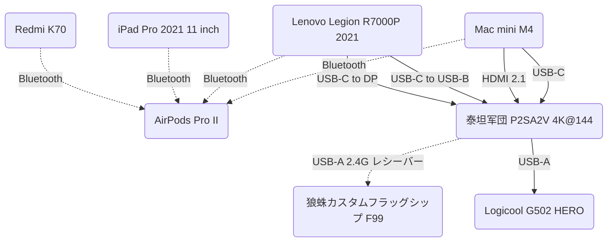

# マルチデバイス連携とカスタマイズ

みなさんこんにちは、今日はみんなが見たいものをお届けしますよ。

一人で複数のデバイスを使う状況はもう珍しくなくなりましたね。ここでは僕のマルチデバイス連携の体験をシェアします。

## デバイス一覧

|      デバイス      |                  型番                   |                                                             簡単な備考                                                              |
| :----------------: | :-------------------------------------: | :---------------------------------------------------------------------------------------------------------------------------------: |
|       スマホ       |               [Redmi K70]               |                                                       USB-C×1；Bluetooth 5.4                                                        |
|     タブレット     |         [iPad Pro 2021 11 inch]         |                                            Thunderbolt 4×1（DP 1.4 対応）；Bluetooth 5.0                                            |
|      ~~Mac~~       |            ~~[Mac mini M2]~~            |                               ~~Thunderbolt 4×2（DP 1.4 対応）；USB-A×2；HDMI 2.0×1；Bluetooth 5.3~~                                |
|        Mac         |              [Mac mini M4]              |                        正面 USB-C 10 Gb/s×2；背面 Thunderbolt 4×3（DP 1.4 対応）；HDMI 2.1×1；Bluetooth 5.3                         |
|     ノート PC      |       [Lenovo Legion R7000P 2021]       |                HDMI 2.1×1；USB-C 10 Gb/s×2（DP 1.4 対応、うち 1 つは PD 100 W 対応）；USB-A 5 Gb/s×4；Bluetooth 5.1                 |
| Bluetooth イヤホン |            [AirPods Pro II]             |                                                       USB-C×1；Bluetooth 5.3                                                        |
|    ディスプレイ    |         泰坦军団 P2SA2V 4K@144          |       DP 1.4×1、HDMI 2.1×2（いずれも DSC 対応）；USB-C×1（DP 1.2、PD 65 W 対応）、USB-B×1、USB-A 5 Gb/s×2（アップストリーム）       |
|     キーボード     | 狼蛛カスタムフラッグシップ F99 シリーズ | USB-C×1、ポーリングレート 1000 Hz；Bluetooth 5.0、ポーリングレート 125 Hz；2.4G 無線、ポーリングレート 1000 Hz；バッテリー 8000 mAh |
|       マウス       |           Logicool G502 HERO            |                                      ボタンマクロプログラミング；デュアルモード高速スクロール                                       |

[Redmi K70]: https://www.mi.com/redmi-k70/specs
[iPad Pro 2021 11 inch]: https://support.apple.com/zh-cn/111897
[AirPods Pro II]: https://support.apple.com/zh-cn/111834
[Mac mini M2]: https://support.apple.com/zh-cn/111837
[Mac mini M4]: https://support.apple.com/zh-cn/121555
[Lenovo Legion R7000P 2021]: https://item.lenovo.com.cn/product/1013207.html

## 参考情報

|   USB プロトコル   |                旧名称                 |  帯域幅  |
| :----------------: | :-----------------------------------: | :------: |
| USB 2.0 Low-Speed  |                USB 1.0                | 1.5 Mb/s |
| USB 2.0 Full-Speed |                USB 1.1                | 12 Mb/s  |
| USB 2.0 High-Speed |                USB 2.0                | 480 Mb/s |
|     USB 5 Gb/s     | USB 3.0、USB 3.1 Gen 1、USB 3.2 Gen 1 |  5 Gb/s  |
|    USB 10 Gb/s     | USB 3.1、USB 3.1 Gen 2、USB 3.2 Gen 2 | 10 Gb/s  |
|    USB 20 Gb/s     |            USB 3.2 Gen 2x2            | 20 Gb/s  |
|    USB 40 Gb/s     |              USB 4 V1.0               | 40 Gb/s  |
|    USB 80 Gb/s     |              USB 4 V2.0               | 80 Gb/s  |

|   パラメータ   | フルファンクション USB-C |    USB 40 Gb/s    |    USB 80 Gb/s    |  Thunderbolt 3   |        Thunderbolt 4         |        Thunderbolt 5         |
| :------------: | :----------------------: | :---------------: | :---------------: | :--------------: | :--------------------------: | :--------------------------: |
|  帯域幅 Gb/s   |            10            |        40         |        80         |      20/40       |              40              |              80              |
|   PCIe Gb/s    |            -             |         -         |         -         |        16        |              32              |              64              |
|   外付け GPU   |          非対応          |    オプション     |    オプション     |       必須       |             必須             |             必須             |
|    PD 給電     |     オプション 100 W     | オプション 100 W  | オプション 240 W  | オプション 100 W | 標準 100 W、オプション 140 W | 標準 140 W、オプション 240 W |
|  リバース給電  |          4.5 W+          |      7.5 W+       |      7.5 W+       |      15 W+       |            15 W+             |            15 W+             |
| 映像プロトコル |    オプション DP 1.4     | オプション DP 2.1 | オプション DP 2.1 |      DP 1.4      |            DP 1.4            |            DP 2.1            |
|    映像伝送    |          4K@120          |   4K@240、8K@60   |    デュアル 4K    |   デュアル 4K    |         デュアル 4K          |         デュアル 8K          |
|   USB 4 規格   |           互換           |       準拠        |       準拠        |       互換       |             準拠             |             準拠             |
| Intel DMA 保護 |            -             |         -         |         -         |    オプション    |             必須             |             必須             |
|  ケーブル認証  |            -             |         -         |         -         |       必須       |             必須             |             必須             |

## ハードウェア接続

各デバイスを物理的に接続するのは、本当に一苦労でした。

[USB-C](https://en.wikipedia.org/wiki/USB-C) でインターフェースを統一できるとはいえ、各ポートが具体的にどのプロトコルをサポートしているかは曖昧で、ネットで各デバイスのポートがどのプロトコルをサポートしているか調べる必要があり、さらにそれらのプロトコルを満たすケーブルも必要です。本当に面倒ですね。

とにかく、僕のセットアップについて話しましょう。

### キーボードとマウスの共有

まず、ノート PC とディスプレイを USB-C to [DP](https://en.wikipedia.org/wiki/DisplayPort) ケーブルで接続すると、ディスプレイは期待通りの 4K@144 モードで映像を表示できます。次に、マウスとキーボードの 2.4G USB レシーバーをディスプレイの USB-A ポートに挿します。

ここで問題が発生しました。理論上、これら 2 つの周辺機器はノート PC に接続されるはずです。DP プロトコルは双方向の USB 信号を送ることができるんです —— とにかく、ノート PC から USB-C to USB-B ケーブルをもう 1 本接続し、ディスプレイの設定で USB-B をアップストリームとして使用します。

そして、ディスプレイと Mac を両端 USB-C のケーブルで接続すると、ディスプレイは 4K@60 の **残念な** モードで映像を表示します —— カスタマーサービスに問い合わせたところ、ディスプレイの USB-C ポートは最大 4K@60 までしかサポートしていないとのことでした。

なぜか分かりませんが、ディスプレイの入力ソースを DP から USB-C に切り替えると、USB-C が USB-B のアップストリーム権限を奪ってしまいます。つまり、この USB-C ケーブルは映像信号と USB 信号の両方を同時に伝送しているんです。

とにかく、これでキーボードとマウスがノート PC と Mac の間を自由に切り替えられるようになりました。しかも、キーボードには Android、Windows、macOS、iOS の 4 つのモードがあり、<KbdGroup><Kbd>Fn</Kbd>+<Kbd>Q/W/E/R</Kbd></KbdGroup> のショートカットキーで切り替えられるので、とても便利です。

### Mac mini M4

Mac mini M4 バージョンに更新した後、以前の HDMI 2.0 ポートが HDMI 2.1 になり、このポートで以前の問題を解決できました。ここでは海贝思の 8K@60（4K@240 との下位互換）対応の両端 HDMI ケーブルを使用して Mac mini をディスプレイに接続し、ディスプレイは 4K@144 モードで映像を表示できます。

そう、このケーブルでノート PC を接続した場合、ディスプレイは 4K@144 モードで映像を表示できず、4K@120 までしかサポートできません。どうやら [DSC ディスプレイストリーム圧縮技術](https://en.wikipedia.org/wiki/Display_Stream_Compression) が機能していないようです…… まあ、これもかなり高いリフレッシュレートではありますが、僕は 144 Hz をフルに使いたいので、ノート PC とディスプレイは USB-C to DP ケーブルで接続するしかありません。

さらに、ディスプレイは入力ソースを切り替える際に「アップストリーム権限を奪う」ようなことはせず、ディスプレイは各入力ソースごとにアップストリームポートを記憶します。ノート PC は USB-B をアップストリームとして使用し、Mac mini は USB-C をアップストリームとして使用します —— ここで注意すべき点は、Mac mini に接続するこの両端 USB-C ケーブルは充電専用でなければならず、データケーブルではいけません。そうでないと、Mac mini は HDMI 2.1 ポートから映像信号を出力すると同時に、USB-C ポートからも映像信号を出力してしまい、かなり面白いことになります。

### オーディオの共有

ここで Mac のクソみたいな設計を名指しで批判したいと思います。ディスプレイに接続した後、ステータスバーで音量を調整できなくなり、調整したければディスプレイのボタンを押すしかありません。完全にバカげています —— Windows の音質は劣化しているから好きに音量調整できるので、Mac を買って Windows デバイスを買わないという人がいるらしいですが —— 超バカげてます。じゃあ僕に足りない音量調整機能は誰が補ってくれるんですか。

とにかく、いくつかのソフトを試した結果、どれも満足できなかったので、Mac の音声再生を直接禁止しました。

そう、解決策は AirPods Pro で Mac にワイヤレス接続することです。これで音量調整はイヤホンのステムをスワイプするだけで OK です。さらに良いことに、AirPods Pro は Apple デバイスのオーディオストリーミングをサポートしており、Mac と iPad を同時にイヤホンに接続でき、どちらかに音が出ればそちらを再生します —— ちょっと待って？なぜ同時じゃないの？バカ Apple 😅

ノート PC は音量を自由に調整できるので、スピーカー出力で OK ですし、もちろんイヤホンを接続しても OK です。

Bluetooth イヤホンに関してもう一つ。僕が AirPods Pro を使い始めてから分かったんですが、他のデバイスは既にイヤホンに接続されているデバイスがある時でも、接続を中断して自分が接続できるんですね。これは Bluetooth イヤホン全般の機能だと思います。

ついでにもう一つ。Mac は iPad に画面ミラーリングできるし、マウスで iPad を操作できます（この 2 つは意味が違います）。これは本当にすごいと思います。~~カッコよくないですか？~~

## ソフトウェア接続

### ファイル転送

[LocalSend](https://github.com/localsend/localsend) を強くお勧めします！これは Flutter で開発されたクロスプラットフォームのファイル転送ソフトで、同じ LAN 内のデバイス同士でファイルをやり取りできます。

じゃあなぜ [SMB](https://en.wikipedia.org/wiki/Server_Message_Block) や [FTP](https://en.wikipedia.org/wiki/File_Transfer_Protocol) を使わないのかって？面倒すぎるからです。IP アドレスはネットワーク環境によって変わるし、ホスト名、ユーザー名、ドメイン、パスワードのどれがどれに対応するのか分からないし、各デバイスに統一されたインターフェースがなく、学習コストが高いんです。

もちろん、どうしても FTP を使いたいなら [MaterialFiles](https://github.com/zhanghai/MaterialFiles) というソフトをお勧めします。これは以前 [クラウドドライブ同期および Obsidian 関連](./Cloud-Drive-Sync-And-Obsidian-Related) で紹介したもので、Android デバイスで FTP サーバーを起動できます。

> [!TIP] 2025-01-05T19:11:42+08:00 追記
>
> 実際にはルーターを設定して IP を固定することができます

### Android 画面を PC にミラーリング

[scrcpy](https://github.com/Genymobile/scrcpy) を強くお勧めします！これは特に優れたミラーリングソフトで、有線接続をサポートしています —— ワイヤレスもできるかも？初めて使ったときに [ADB](https://developer.android.com/tools/adb) に似ているなと感じたので —— マウス操作、高リフレッシュレート……

詳しくは多くは語りませんが、少しハードルが高いのは GUI のないソフトだという点です。もちろん、誰かが GUI をラップしたものを探すこともできます。

## その他

Windows の拡張性は macOS よりもずっと高いです。[Wallpaper Engine](https://store.steampowered.com/app/431960/Wallpaper_Engine) が macOS 版だったら、僕は夢で笑っちゃいますよ。次はほとんど Windows 関連のことを話します。

### ドック

macOS にはドックがあり、Windows にはタスクバーがありますが、すべてのプログラムを「タスクバーにピン留め」したくありません。幸いなことに [LightFrame](https://lightframe.vertillusion.xyz) というソフトがあり、その中に Minecraft のインベントリ風ドックというコンポーネントがあります。これは本当に素晴らしいアイデアなので、ガンガン使っています —— でも欠点もあります：作者がオープンソースにしておらず、年齢が若い（？）ため、コードがぐちゃぐちゃな可能性が高い；最前面設定がよく無効になる問題がある、マルチディスプレイに対応していない問題がある（外付けディスプレイにドラッグすると、その後ノート PC だけで使うときに見えなくなる）、[DPI](https://en.wikipedia.org/wiki/Dots_per_inch) の変化に対応していない問題がある —— ディスプレイ間でドラッグしてもサイズが変わらない。

最大の問題は、macOS でも使いたいのですが、全く対応していないことです。

個人的には Flutter でヘッドレスアプリケーション —— GUI がなくてもバックグラウンドで実行できるアプリ —— とマルチビュー —— 0 個または複数のウィンドウをサポート —— を実装した後、自分で作りたいと思っています。

### マウスマクロ

Logicool マウスはボタンマクロプログラミングをサポートしており、つまりキーマッピングをサポートしています。しかも Windows と macOS の両方に対応しています。

|     アプリ     | 設定                                                                                                                                            |
| :------------: | ----------------------------------------------------------------------------------------------------------------------------------------------- |
| Microsoft Edge | ホイール左右傾倒で `タブを戻る` と `タブを進む`、つまりブラウザ履歴のジャンプ；サムボタン上下で `タブを再開` と `タブを閉じる`                  |
|   Minecraft    | G Shift キーで連続攻撃、mob トラップでの AFK に便利                                                                                             |
|     VSCode     | G Shift キーを F5 にマッピング、デバッグに便利；サムボタン上下で `前の位置へジャンプ` と `次の位置へジャンプ`、つまりカーソル位置履歴のジャンプ |

遊び方はたくさんあって、とても役立ちます。

### グローバルツール

Windows では [PowerToys](https://github.com/microsoft/PowerToys) の [PowerToys Run](https://learn.microsoft.com/zh-cn/windows/powertoys/run) をお勧めします。macOS では [Raycast](https://www.raycast.com) をお勧めします。

クイックランチャーを呼び出すショートカットキーは何を使うか？Windows では <KbdGroup><Kbd>Ctrl</Kbd>+<Kbd>Win</Kbd>+<Kbd>Alt</Kbd>+<Kbd>␣</Kbd></KbdGroup> です。macOS では……

僕が知るわけないでしょう。macOS のキー配置は変だし、キーボードを macOS モードに切り替えると <Kbd>Win</Kbd> と <Kbd>Alt</Kbd> が入れ替わって、さらに macOS の設定で <Kbd>Command</Kbd> と <Kbd>Ctrl</Kbd> を入れ替えて、やっと macOS のキー配置が Windows と一致しました。

ここでは、macOS の方がより良い仕事をしています。拡張が多い —— 翻訳、辞書、ChatGPT 対話など、ただし一部の機能はサブスクリプション課金が必要 —— 各機能にグローバルショートカットキーをカスタマイズでき、インターフェースも快適 —— 比較して、Windows の最初のスタイルは醜すぎて全く使いたくなかった —— macOS に本来あるべき多くの機能を補完しています。

例えば：Windows の <KbdGroup><Kbd>Win</Kbd>+<Kbd>V</Kbd></KbdGroup> クリップボード、QQ が提供する <KbdGroup><Kbd>Ctrl</Kbd>+<Kbd>Alt</Kbd>+<Kbd>A</Kbd></KbdGroup> スクリーンショット機能、Windows の Everything グローバル検索機能。

そうそう、[Everything](https://www.voidtools.com/support/everything) について話しましょう。これは Windows 上の非常に強力なグローバル検索ソフトで、瞬時に結果を検索でき、正規表現もサポートしています。

最新バージョン `1.5a (1.5.0.1366a)` ではダークモードもサポートされ、純粋に鑑賞作品です！

### より良い Windows 11

より良い Windows 11 とは Windows 10 のことです。Windows 11 の一部は本当に Windows 10 に及びません。そこで [ExplorerPatcher](https://github.com/valinet/ExplorerPatcher) というツールがあり、Windows 11 をより Windows 10 らしく改造します。一部の機能は以下の通り：

- Win 10 と Win 11 のタスクバーを自由に切り替え、タブ結合、機能表示などを設定可能。
- Win 10 の右クリックメニューとファイルエクスプローラーのコマンドバーを復元。
- スタートメニューのバージョン切り替え、推奨を無効化、すべてのアプリページを自動的に開く。
- アプリスイッチャーをカスタマイズ、Win 11、Win 10、Win NT などのスタイルを選択可能。

😤 Microsoft、開発者がどうやって仕事をするか、よく見て学びなさい 😤

### その他

さらに詳しくは [この GitHub リポジトリ](https://github.com/Cierra-Runis/desktop_modified) をご覧ください。より多くのカスタマイズツールを共有しています。

## トポロジ図

