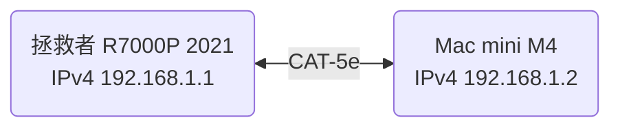
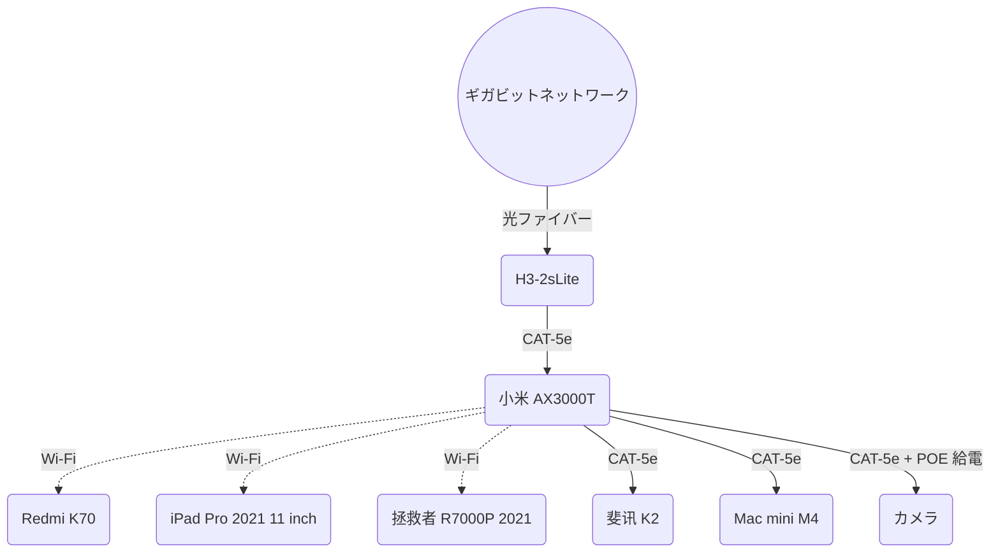

# ネットワーク

コンピュータネットワークは非常に面白いものだが、かつての教育方法が僕に嫌悪感を抱かせてしまった。これは悲しいことだ。僕は現実から出発することが好きで、教科書から出発することは好きではない。

まずは表を作って、自分が持っているデバイスがどのようなネットワーク接続方式に対応しているかを見てみよう。

## デバイスリスト

|      デバイス      |           型番           |               有線                |      Wi-Fi 世代       |                                         簡易備考                                         |
| :----------------: | :----------------------: | :-------------------------------: | :-------------------: | :--------------------------------------------------------------------------------------: |
|       スマホ       |       [Redmi K70]        |                 -                 | Wi-Fi 7[^1]、Wi-Fi 6E |                           MLO；MIMO 2x2；[同時デュアルバンド]                            |
|     タブレット     | [iPad Pro 2021 11 inch]  |                 -                 |       Wi-Fi 6E        |                        2.4G、5G [同時デュアルバンド]；MIMO 80 MHz                        |
|        Mac         |      [Mac mini M4]       |       RJ45 ギガビットポート       |       Wi-Fi 6E        |                                            -                                             |
|   ~~ノート PC~~    | ~~[拯救者 R7000P 2021]~~ |     ~~RJ45 ギガビットポート~~     |      ~~Wi-Fi 6~~      |                                            -                                             |
|  デスクトップ PC   |           DIY            |    シングル RJ45 2.5 G ポート     |        Wi-Fi 7        |                                            -                                             |
|        ONU         |        H3-2sLite         | 4 つの RJ45 ギガビット LAN ポート |   気にする必要なし    |                                            -                                             |
| ~~メインルーター~~ |   ~~[锐捷 RG-MA3063]~~   | ~~4 つの RJ45 ギガビットポート~~  |      ~~Wi-Fi 6~~      |     ~~最大 3000 Mb/s；MIMO 2x2；4 つのポートのいずれかを WAN ポートとして使用可能~~      |
|   メインルーター   |      [小米 AX3000T]      |   4 つの RJ45 ギガビットポート    |        Wi-Fi 6        | 最大 574 + 2402 ≈ 3000 Mb/s；MIMO 2x2；4 つのポートのいずれかを WAN ポートとして使用可能 |
|    サブルーター    |        [斐讯 K2]         |    5 つの RJ45 100Mbps ポート     |        Wi-Fi 5        |                 最大 1200 Mb/s；5 つのポートのうち 1 つが固定 WAN ポート                 |

[^1]: Wi-Fi 7 関連機能は OTA アップグレード後に開放され、具体的な時期は関連規制当局の承認後にプッシュされる

[Redmi K70]: https://www.mi.com/redmi-k70/specs
[iPad Pro 2021 11 inch]: https://support.apple.com/zh-cn/111897
[Mac mini M4]: https://support.apple.com/zh-cn/121555
[拯救者 R7000P 2021]: https://item.lenovo.com.cn/product/1013207.html
[锐捷 RG-MA3063]: https://www.acwifi.net/21472.html
[小米 AX3000T]: https://www.mi.com/xiaomi-ax3000t
[斐讯 K2]: https://product.yesky.com/product/977/977854/param.shtml
[同時デュアルバンド]: #デュアルバンド統合と同時デュアルバンド

## 参考情報

事前に宣言：本文の内容は参考用のみで、情報源を基準としてください。

### ビット、バイト、レートの換算について

- 換算関係
  - 1 Byte = 8 bit
  - 通信などの分野
    - 1 KB = 1000 Byte
    - 1 MB = 1000 KB
    - 1 GB = 1000 MB
  - コンピュータストレージ
    - 1 KiB = 1024 Byte
    - 1 MiB = 1024 KiB
    - 1 GiB = 1024 MiB
- 一般的な速度
  - 100 Mb/s = 12.5 MB/s = 11.921 MiB/s
  - 1000 Mb/s = 125 MB/s = 119.21 MiB/s
  - 10000 Mb/s = 1.25 GB/s = 1.164 GiB/s

個人的には Byte ではなく bit を使って速度を表すのが非常に嫌いだ。まったく直感的ではないし、1000 進法も嫌いだ。

### Wi-Fi 世代

下表は [ウィキペディア](https://zh.wikipedia.org/wiki/Wi-Fi#%E4%B8%96%E4%BB%A3) から引用：

| Wi-Fi 世代 | IEEE 規格  |    年    |   最大速度    | 周波数帯 GHz |
| :--------: | :--------: | :------: | :-----------: | :----------: |
|  Wi-Fi 4   | [802.11n]  |   2009   |    75 MB/s    |    2.4、5    |
|  Wi-Fi 5   | [802.11ac] |   2013   |   867 MB/s    |    5[^2]     |
|  Wi-Fi 6   | [802.11ax] |   2021   |   1.2 GB/s    |    2.4、5    |
|  Wi-Fi 6E  | [802.11ax] |   2021   |   1.2 GB/s    |    6[^3]     |
|  Wi-Fi 7   | [802.11be] | 2024[^4] | 2.88 GB/s[^5] |  2.4、5、6   |
|  Wi-Fi 8   | [802.11bn] | ~~2028~~ |   12.5 GB/s   |  2.4、5、6   |

[^2]: Wi-Fi 5 は 5 GHz 帯での動作のみを規定しており、2.4 GHz 帯での動作は Wi-Fi 4 で規定されている

[^3]: Wi-Fi 6E は 6 GHz 帯で動作する Wi-Fi デバイスの業界名称で、Wi-Fi 6 の機能と特性を提供し、6 GHz 帯に拡張したもの

[^4]: Wi-Fi アライアンスは 2024 年に Wi-Fi 7 デバイスの認証を開始したが、2025 年 1 月時点で Wi-Fi 7 はまだ正式に承認されていない

[^5]: 中国語版ウィキペディアの値は古くなっており、英語版ウィキペディアを基準とする

[802.11n]: https://zh.wikipedia.org/wiki/IEEE_802.11n
[802.11ac]: https://zh.wikipedia.org/wiki/IEEE_802.11ac
[802.11ax]: https://zh.wikipedia.org/wiki/Wi-Fi_6
[802.11be]: https://zh.wikipedia.org/wiki/Wi-Fi_7
[802.11bn]: https://zh.wikipedia.org/wiki/IEEE_802.11bn

- ここでは Wi-Fi 6、つまり現在最も一般的に使用されている Wi-Fi 世代に注目すれば十分で、Wi-Fi 7 は未来への投資に属する
- また、中国本土では 6 GHz 帯はまだ開放されていない —— 永遠に開放されない可能性もある 🤗

### Wi-Fi 速度

[この動画](https://www.bilibili.com/video/av787776505) を参照：

Wi-Fi 最大速度 = エンコード方式 × コードレート × 最大チャネル有効サブキャリア数 × 単位時間シンボル伝送数 × 空間ストリーム数

Wi-Fi 6 と Wi-Fi 7 を例にすると、その最大速度の計算は以下の通り：

| Wi-Fi 世代 | 変調方式 | エンコード方式 | コードレート | 帯域幅  | 単位時間シンボル伝送数 | 空間ストリーム数 | 最大速度  |
| :--------: | :------: | :------------: | :----------: | :-----: | :--------------------: | :--------------: | :-------: |
|  Wi-Fi 6   | 1024-QAM |       10       |     5/6      | 160 MHz |         73529          |     MIMO 8x8     | 1.2 GB/s  |
|  Wi-Fi 7   | 4096-QAM |       12       |     5/6      | 320 MHz |         73529          |     MIMO 8x8     | 2.88 GB/s |

- ほとんどのデバイスは MIMO 2x2、つまり 300 MB/s と 720 MB/s に対応
- 変調方式については [この動画](https://www.bilibili.com/video/av113683137041105) を参照

実は [Wi-Fi 6 英語版ウィキペディア](https://en.wikipedia.org/wiki/Wi-Fi_6#Rate_set) には単一空間ストリーム最大速度の表が提供されており、中国語版ウィキペディアよりも簡潔だ。

### デュアルバンド統合と同時デュアルバンド

デュアルバンド統合、別名デュアルバンド優先選択は、~~即時~~同時デュアルバンド RSDB または並行デュアルバンド SDB をサポートするデバイスが必要で、ルーターが 2.4 GHz と 5 GHz の両方の周波数帯を同時に開き、デバイス自身に接続する周波数帯を選択させることを指す。

とにかくクソなので使わないこと。しかも彼らの表現はいつも混在している。具体的にはこの [知乎の回答](https://www.zhihu.com/question/355416265/answer/891769324) を見てほしい。理解できなくても問題ない。

### イーサネット Ethernet

|   速度   |  非公式名称   | IEEE 規格 | ケーブルタイプ | 最大伝送距離 |
| :------: | :-----------: | :-------: | :------------: | :----------: |
| 10 Mb/s  |  [10BASE-T]   |   802.3   |  ツイストペア  |    100 m     |
| 100 Mb/s |   100BASE-T   |  802.3u   |  ツイストペア  |    100 m     |
|  1 Gb/s  | [1000BASE-LX] |  802.3z   |  光ファイバー  |    5000 m    |
|  1 Gb/s  | [1000BASE-T]  |  802.3ab  |  ツイストペア  |    100 m     |
| 2.5 Gb/s | [2.5GBASE-T]  |  802.3bz  |  ツイストペア  |    100 m     |
|  5 Gb/s  |  [5GBASE-T]   |  802.3bz  |  ツイストペア  |    100 m     |
| 10 Gb/s  |  [10GBASE-T]  |  802.3an  |  ツイストペア  |    100 m     |

[10BASE-T]: https://zh.wikipedia.org/wiki/10BASE-T
[1000BASE-LX]: https://zh.wikipedia.org/wiki/吉比特以太网#1000BASE-LX
[1000BASE-T]: https://zh.wikipedia.org/wiki/吉比特以太网#1000BASE-T
[2.5GBASE-T]: https://zh.wikipedia.org/zh-cn/2.5GBASE-T與5GBASE-T
[5GBASE-T]: https://zh.wikipedia.org/zh-cn/2.5GBASE-T與5GBASE-T
[10GBASE-T]: https://zh.wikipedia.org/wiki/10吉比特乙太網路#10GBASE-T

### ツイストペア CAT

下表は [この動画](https://www.bilibili.com/video/av459211809) から引用：

|   規格   | 通常シールドモード | 通常線規 AWG | 帯域幅 MHz | 100 Mb/s | 1 Gb/s | 2.5 Gb/s | 5 Gb/s | 10 Gb/s |
| :------: | :----------------: | :----------: | :--------: | :------: | :----: | :------: | :----: | :-----: |
| [CAT-5]  |        UTP         |      24      |    100     |    🉑    |        |          |        |         |
| [CAT-5e] |        UTP         |      24      |    125     |    🉑    |   🉑   |  不安定  | 不安定 |         |
| [CAT-6]  |   UTP または STP   |      23      |    250     |    🉑    |   🉑   |    🉑    | 不安定 |  55 m   |
| [CAT-6A] |        STP         |      23      |    500     |    🉑    |   🉑   |    🉑    |   🉑   |   🉑    |
| [CAT-7]  |       S/FTP        |      23      |    600     |    🉑    |   🉑   |    🉑    |   🉑   |   🉑    |
| [CAT-7A] |       S/FTP        |      22      |    1000    |    🉑    |   🉑   |    🉑    |   🉑   |   🉑    |

[CAT-5]: https://zh.wikipedia.org/wiki/CAT-5
[CAT-5e]: https://zh.wikipedia.org/wiki/CAT-5#Category_5e
[CAT-6]: https://zh.wikipedia.org/wiki/CAT-6
[CAT-6A]: https://zh.wikipedia.org/wiki/CAT-6#Category_6A
[CAT-7]: https://zh.wikipedia.org/wiki/CAT-7
[CAT-7A]: https://zh.wikipedia.org/wiki/CAT-7#Class_FA

- CAT-6A を超えるケーブルの場合は光ファイバーを検討してください

自分でツイストペアケーブルを見つけたところ、`AMPHENGKE CAT5E UTP 24AWG 4PAIR AWM 2835 60°C FT4 VERIFIED MADE IN CHINA 063 M` と書かれていた。その中で AMPHENGKE は~~某無名~~ブランド、規格は CAT-5e、線規は 24 AWG、最高温度は 60 °C、FT4 は CSA 防火等級、VERIFIED は検証済みを表し、MADE IN CHINA は産地、063 M は切断を容易にするための長さ表示だ。

## ネットワーク相互接続

ここで先に一点説明しておくと、ネットワーク設定は実に難しく、上記の参考情報だけでもかなりの紙幅を占めており、関連するコンピュータネットワークの知識もここには列挙していない。そして、アイデアは多くの場合単なるアイデアであり、実際に操作しようとすると、やはり多くの問題に遭遇する。現在の僕の家のネットワーク設定に関して言えば、これは深く考え抜かれた結果ではなく、解決困難な問題 —— 例えば壁内埋め込み線の規格問題 —— も一時的に保留するしかなく、将来能力と財力があるときに再び解決することになる。

僕は今、家で 1000 Mb/s の光ファイバーブロードバンドを契約している。屋外の光ファイバー線を融着し、ピグテール接続後に ONU に接続し、ONU は CAT-5e ネットワークケーブルを介してメインルーターの LAN1 ポートに接続し、自動的に WAN ポートとして使用される。メインルーターの LAN2 ポートはサブルーターの WAN ポートに接続され、メインルーターの LAN3 ポートは [Mac mini M4](#デバイスリスト) の RJ45 ポートに接続されている。

## ローカルドメイン

まず注意すべき点は、ドメインを使用してローカルに接続する際は `localhost` を使用すること。ほぼすべてのデバイスがこれを IPv4 の `127.0.0.1` または IPv6 の `::1` と自動的にバインドする。

[マルチデバイス連携とカスタマイズ](./Multi-Device-Collaboration-And-Customize#デスクトップカスタマイズ) でも言及したが、IP の変化は不快なものだ。固定 IP はこの問題を解決できるが、一つはルーターへの管理権限が必要で、二つ目はルーターが IP を固定できる機能を持っている必要があり、さらに別の LAN に変わると、また再設定しなければならない。しかし、ローカルドメインにはこれらの問題がない。

ローカルドメインはどうやって取得するのか？ macOS と Windows はともに `hostname` コマンドを使えばよく、結果はそれぞれ `Mac-mini.local` と `Cierra_Runis` だ。

もちろん、ここで [予約 IP アドレス](https://zh.wikipedia.org/zh-cn/%E4%BF%9D%E7%95%99IP%E5%9C%B0%E5%9D%80) と [IPv6 アドレス割り当て状況](http://comeround.cn/article/ipv6-address.html) のリンクを提供しておくので、自分で確認してほしい。[セキュリティ上の理由](http://hello.fe80.cn/pages/ipv6/i6.html) から、予約 IP アドレス以外のアドレスを公開しないでください —— IPv6 の割り当ては厳密に管理されているため、デバイスの位置を調べることができる。僕自身が調べると県レベルまで正確だ。

下表は `ifconfig` と `ipconfig /all` コマンドから引用：

|      デバイス      |                IP                 |           タイプ            |
| :----------------: | :-------------------------------: | :-------------------------: |
|      Mac mini      |         ☀️192.168.2.69/24         |  IPv4 LAN プライベート IP   |
|      Mac mini      | 🌞fe80::8bc:15d5:9bc3:9771%en1/64 | IPv6 リンクローカルアドレス |
| 拯救者 R7000P 2021 |         🌕192.168.2.75/24         |  IPv4 LAN プライベート IP   |
| 拯救者 R7000P 2021 | 🌝fe80::98b4:7a27:b5c0:d12f%18/64 | IPv6 リンクローカルアドレス |

- ここでなぜ %en1 で下が %9 なのかわからないが、[ウィキペディア](https://zh.wikipedia.org/wiki/IPv6#cite_ref-rfc4007_7-0) と [RFC 4007](https://datatracker.ietf.org/doc/html/rfc4007#section-11.2) によると、異なる OS で異なる命名規則がある。

僕自身、Mac mini と拯救者 R7000P 2021 に Clash Verge 仮想ネットワークカードを起動および停止した状態で、`ping` コマンドを使用して以下の結果を得た：

|     OS      |     テストドメイン     | ping 表示ドメイン  | 両方とも閉じる |  両方とも開く   | 結果 |
| :---------: | :--------------------: | :----------------: | :------------: | :-------------: | :--: |
|    macOS    |         _Mac_          |      mac.lan       |  198.18.1.87   |   198.18.1.87   |  💢  |
|    macOS    |       _Mac.lan_        |      mac.lan       |  198.18.1.87   |   198.18.1.87   |  💢  |
|    macOS    |      _Mac.local_       |         -          |       -        |        -        |  💩  |
|   Windows   |         _Mac_          |      Mac.lan       |       ☀️       |       ☀️        |  💔  |
|   Windows   |       _Mac.lan_        |      Mac.lan       |       ☀️       | 198.18.0.69[^6] | 💢💢 |
|   Windows   |      _Mac.local_       |     Mac.local      |       -        | 198.18.0.70[^6] | 💢💢 |
|    macOS    |      ~~Mac-mini~~      |    mac-mini.lan    |  198.18.1.83   |   198.18.1.83   |  💢  |
|    macOS    |    ~~Mac-mini.lan~~    |    mac-mini.lan    |  198.18.1.83   |   198.18.1.83   |  💢  |
|    macOS    |   ~~Mac-mini.local~~   |   mac-mini.local   |   127.0.0.1    |    127.0.0.1    |  😄  |
|   Windows   |      **Mac-mini**      |   Mac-mini.local   |      🌞%9      |      🌞%9       |  🚀  |
|   Windows   |    **Mac-mini.lan**    |    Mac-mini.lan    |       -        | 198.18.0.71[^6] | 💢💢 |
| **Windows** |   **Mac-mini.local**   |   Mac-mini.local   |      🌞%9      | 198.18.0.72[^6] | 💢💢 |
|  **macOS**  |    **Cierra_Runis**    |  cierra_runis.lan  |  198.18.1.82   |   198.18.1.82   |  💢  |
|    macOS    |  **Cierra_Runis.lan**  |  cierra_runis.lan  |  198.18.1.82   |   198.18.1.82   |  💢  |
|    macOS    | **Cierra_Runis.local** | cierra_runis.local |       🌕       |       🌕        |  🚀  |
|   Windows   |    ~~Cierra_Runis~~    |    Cierra_Runis    |     🌝%18      |      🌝%18      |  😄  |
|   Windows   |  ~~Cierra_Runis.lan~~  |  Cierra_Runis.lan  |       🌕       | 198.18.0.73[^6] | 💢💢 |
|   Windows   | ~~Cierra_Runis.local~~ |    Cierra_Runis    |     🌝%18      |      🌝%18      |  😄  |

[^6]: Clash Verge による連続的な IP アドレスの変化

- 打消し線部分は不要なテストで、`localhost` を使用してください
- 太字部分は重要なテスト
- 斜体部分は他の LAN で再現できるかどうか不確定なテスト
- 💢: 使用不可の 198.18.x.x セグメント
- 💩: 完全に通信不可
- 💔：このドメインはルーター管理画面のデバイスリスト名
- 💢💢：使用不可の 198.18.x.x セグメントで、2 回の結果が異なる
- 😄：「そんなにローカルドメインにこだわって何してるの？僕に欠けている `localhost` を誰が補ってくれるんだよ？」

まとめると、2 つの最も重要なテスト、4 つの結果のうち 1 つだけが使用可能で、少し恥ずかしい。

そして最終的な結果は明らかで、Mac mini が出すドメインは `.local` を取り除いて Windows で使用し、Windows は逆に —— なんて極限のホームスイッチ？

### Windows と macOS におけるローカルドメインの違い

Windows では、`hostname` コマンドで得られる結果はデバイス名で、これは `設定 > システム` で確認・変更できる —— ここでは `Laptop` に変更した。

Mac のバージョンを更新後、`hostname` は `Mac.lan` を返す。調査によると、以下の表がある：

|           コマンド           |        出力         |                            備考                            |
| :--------------------------: | :-----------------: | :--------------------------------------------------------: |
|          `hostname`          |       Mac.lan       |            `fastfetch` を使うと `Mac` が見える             |
|   `scutil --get HostName`    |  HostName: not set  |                             -                              |
| `scutil --get LocalHostName` |      Mac-mini       | `システム設定 > 共有` で確認でき、続く `.local` は変更不可 |
| `scutil --get ComputerName`  | 某不科学の Mac mini |      `システム設定 > この Mac について` で確認できる       |

最終的なテスト結果は：

|   OS    | テストドメイン | ping 表示ドメイン |   両方とも開く   |
| :-----: | :------------: | :---------------: | :--------------: |
|  macOS  |     Laptop     |    laptop.lan     |        🌕        |
|  macOS  |   Laptop.lan   |    laptop.lan     |        🌕        |
|  macOS  |  Laptop.local  |   laptop.local    |        🌕        |
| Windows |    Mac-mini    |  Mac-mini.local   |       🌞%9       |
| Windows |  Mac-mini.lan  |   Mac-mini.lan    | 198.18.0.127[^6] |
| Windows | Mac-mini.local |  Mac-mini.local   | 198.18.0.129[^6] |

したがって、[ローカルドメイン](#ローカルドメイン) セクションで示した結論は依然として適用される。

補足すると、ルーター管理画面で確認できるデバイスリストでは、Windows デバイスの名前が `Laptop` に変わり、Mac mini の名前は `Mac` だ。

`sudo scutil --set HostName 'Mac-mini.local'` を試してマシンを再起動して結果を見てみよう —— 答えはテスト結果に変化なし、前の表の最初の 2 つの出力が `Mac-mini.local` に変わった —— `sudo scutil --set HostName ''` で再度クリアすることを忘れずに。

## DDNS

では、なぜローカルドメインに限定する必要があるのか？みなさん、僕は DDNS です。今日はみんなが見たいものをお届けします。

IPv6 は IPv4 の問題を解決した、というようなたわごとは省略。まず ONU、ルーター、デバイスすべてが IPv6 をサポートし、有効にしていることを確認し、IPv6 アドレスを取得できることを保証する。

このウェブサイト `note-of-me.top` のドメイン解決サービスプロバイダーは [Alibaba Cloud](https://www.aliyun.com) で、Alibaba Cloud は無料のドメイン解決サービスを提供している。これを使って DDNS を実現できる。

まず、Alibaba Cloud の AccessKey ID と AccessKey Secret を取得する必要がある。具体的な操作は省略するが、とにかく [Alibaba Cloud CLI](https://www.alibabacloud.com/help/zh/cli/installation-guide/) ツールを設定完了する必要がある。

::: code-group

```Bash [$HOME/.local/bin/ddns ~vscode-icons:file-type-agents~]
#!/bin/bash
set -euo pipefail

if ! command -v jq >/dev/null; then
echo "Error: 'jq' is not installed. You can install it with 'brew install jq' on macOS."
exit 1
fi

if ! command -v aliyun >/dev/null; then
echo "Error: 'aliyun' CLI is not installed. See https://github.com/aliyun/aliyun-cli for installation instructions."
exit 1
fi

# https://api.aliyun.com/document/Alidns/2015-01-09/AddDomainRecord

DOMAIN_NAME="note-of-me.top"
RR=$(scutil --get LocalHostName) # LocalHostName をプレフィックスとして使用
RECORD_TYPE="AAAA"

IPV6_ADDR=$(ifconfig "$(route -n get -inet6 default | awk '/interface:/ {print $2}')" |
awk '/inet6/ && !/fe80/ {print $2}' |
grep -vE 'temporary|dynamic' |
head -n1)

if [ -z "$IPV6_ADDR" ]; then
echo "[$(date '+%F %T')] IPv6 アドレスが利用できません"
exit 1
fi

RECORD_INFO=$(aliyun alidns DescribeSubDomainRecords \
  --SubDomain "$RR.$DOMAIN_NAME" \
  --Type "$RECORD_TYPE")

RECORD_ID=$(echo "$RECORD_INFO" | jq -r '.DomainRecords.Record[0].RecordId // empty')
RECORD_IP=$(echo "$RECORD_INFO" | jq -r '.DomainRecords.Record[0].Value // empty')

echo "[$(date '+%F %T')] 現在の DNS: $RECORD_IP"

if [ -n "$RECORD_ID" ]; then
if [ "$RECORD_IP" = "$IPV6_ADDR" ]; then
echo "[$(date '+%F %T')] IPv6 ($IPV6_ADDR) 変更なし"
    exit 0
  fi
  echo "[$(date '+%F %T')] $RR.$DOMAIN_NAME を更新中: $RECORD_IP => $IPV6_ADDR"
  aliyun alidns UpdateDomainRecord \
    --RecordId "$RECORD_ID" \
    --RR "$RR" \
    --Type "$RECORD_TYPE" \
    --Value "$IPV6_ADDR" >/dev/null
else
  echo "[$(date '+%F %T')] $RR.$DOMAIN_NAME を作成中 => $IPV6_ADDR"
  aliyun alidns AddDomainRecord \
    --DomainName "$DOMAIN_NAME" \
    --RR "$RR" \
    --Type "$RECORD_TYPE" \
    --Value "$IPV6_ADDR" >/dev/null
fi

```

```PowerShell [$HOME/.local/bin/ddns.ps1]
# 必要条件: aliyun CLI がアカウント設定済み
# 以下のパラメータを変更してください
$DomainName = "note-of-me.top"
$RR = $env:COMPUTERNAME  # または [System.Net.Dns]::GetHostName()
$RecordType = "AAAA"

# IPv6 アドレスを取得
function Get-PreferredIPv6Address {
    # すべての候補 IPv6 アドレスを取得
    $candidates = Get-NetIPAddress -AddressFamily IPv6 |
        Where-Object {
            $_.AddressState -eq "Preferred" -and
            $_.IPAddress -notmatch "^fe80" -and
            ([System.Net.IPAddress]::Parse($_.IPAddress).GetAddressBytes()[0] -band 0b11100000) -eq 0b00100000
        }

    # DHCP 割り当てアドレスを優先
    $target = $candidates |
        Where-Object { $_.PrefixOrigin -eq "Dhcp" -and $_.SuffixOrigin -eq "Dhcp" } |
        Select-Object -First 1

    if (-not $target) {
        # 次に RouterAdvertisement 割り当てでランダムサフィックスでないアドレスを選択
        $target = $candidates |
            Where-Object { $_.PrefixOrigin -eq "RouterAdvertisement" -and $_.SuffixOrigin -ne "Random" } |
            Select-Object -First 1
    }

    if (-not $target) {
        Write-Host "[$(Get-Date -Format 'yyyy-MM-dd HH:mm:ss')] ❌ 適切な IPv6 アドレスが見つかりません"
        return $null
    }

    Write-Host "[$(Get-Date -Format 'yyyy-MM-dd HH:mm:ss')] ✅ IPv6 アドレスを使用: $($target.IPAddress)"
    return $target.IPAddress
}


# 現在のレコードを取得
$ipv6Addr = Get-PreferredIPv6Address

$recordInfoRaw = & aliyun alidns DescribeSubDomainRecords `
    --SubDomain "$RR.$DomainName" `
    --Type "$RecordType"

if (-not $recordInfoRaw) {
    Write-Host "[$(Get-Date -f 'yyyy-MM-dd HH:mm:ss')] レコード情報の取得に失敗しました"
    exit 1
}

$recordInfo = $recordInfoRaw | ConvertFrom-Json
$record = $recordInfo.DomainRecords.Record | Select-Object -First 1
$recordId = $record.RecordId
$currentIP = $record.Value

Write-Host "[$(Get-Date -f 'yyyy-MM-dd HH:mm:ss')] 現在の DNS: $currentIP"

if ($recordId) {
    if ($currentIP -eq $ipv6Addr) {
        Write-Host "[$(Get-Date -f 'yyyy-MM-dd HH:mm:ss')] IPv6 ($ipv6Addr) 変更なし"
        exit 0
    }

    Write-Host "[$(Get-Date -f 'yyyy-MM-dd HH:mm:ss')] $RR.$DomainName を更新中\: $currentIP => $ipv6Addr"

    & aliyun alidns UpdateDomainRecord `
        --RecordId $recordId `
        --RR $RR `
        --Type $RecordType `
        --Value $ipv6Addr | Out-Null
} else {
    Write-Host "[$(Get-Date -f 'yyyy-MM-dd HH:mm:ss')] $RR.$DomainName を作成中 => $ipv6Addr"

    & aliyun alidns AddDomainRecord `
        --DomainName $DomainName `
        --RR $RR `
        --Type $RecordType `
        --Value $ipv6Addr | Out-Null
}

```

:::

## 過去に戻る

2 台のデバイスをネットワークケーブルで直接接続すると、これが最もシンプルな LAN だ —— チュートリアルは [この動画](https://www.bilibili.com/video/av424790900) を参照：

Wi-Fi が今回の実験に影響を与えないように、まずノート PC と Mac mini の Wi-Fi をオフにし、その後 CAT-5e ネットワークケーブルを使って接続する。次に簡単な設定を行う：

|                ノート PC                |                Mac mini                 |
| :-------------------------------------: | :-------------------------------------: |
|              Windows 設定               |              システム設定               |
|      ネットワークとインターネット       |              ネットワーク               |
|              イーサネット               |              イーサネット               |
|                  編集                   |                詳細情報                 |
|               手動を選択                |               IPv4 を設定               |
|               IPv4 をオン               |               手動を選択                |
|  IP アドレスに 192.168.1.**1** を入力   |  IP アドレスに 192.168.1.**2** を入力   |
| サブネットマスクに 255.255.255.0 を入力 | サブネットマスクに 255.255.255.0 を入力 |

これで以下の LAN トポロジ図ができた：



両デバイスの RJ45 ポートと CAT-5e ネットワークケーブルはともに 1000 Mb/s をサポートしているため、[iperf3](https://github.com/esnet/iperf) を使用して 2 台のデバイス間の最大転送速度をテストできる：

Mac mini で `iperf3 -s` を使ってサーバーを起動し、ノート PC で `iperf3 -c 192.168.1.2` を使ってサーバーに接続すると、テスト結果は以下の通り：

<Accordion type='single' collapsible>
<AccordionItem value='iperf3-test'>
<AccordionTrigger>正方向テスト</AccordionTrigger>
<AccordionContent>

```PowerShell
PS > iperf3 -c 192.168.1.2
Connecting to host 192.168.1.2, port 5201
[  5] local 192.168.1.1 port 55591 connected to 192.168.1.2 port 5201
[ ID] Interval           Transfer     Bitrate
[  5]   0.00-1.01   sec   117 MBytes   976 Mbits/sec
[  5]   1.01-2.01   sec   113 MBytes   944 Mbits/sec
[  5]   2.01-3.01   sec   113 MBytes   945 Mbits/sec
[  5]   3.01-4.01   sec   112 MBytes   940 Mbits/sec
[  5]   4.01-5.01   sec   113 MBytes   949 Mbits/sec
[  5]   5.01-6.01   sec   113 MBytes   946 Mbits/sec
[  5]   6.01-7.01   sec   112 MBytes   948 Mbits/sec
[  5]   7.01-8.01   sec   113 MBytes   950 Mbits/sec
[  5]   8.01-9.01   sec   113 MBytes   944 Mbits/sec
[  5]   9.01-10.01  sec   113 MBytes   944 Mbits/sec
- - - - - - - - - - - - - - - - - - - - - - - - -
[ ID] Interval           Transfer     Bitrate
[  5]   0.00-10.01  sec  1.11 GBytes   949 Mbits/sec                  sender
[  5]   0.00-10.03  sec  1.10 GBytes   945 Mbits/sec                  receiver

iperf Done.
```

</AccordionContent>
</AccordionItem>
<AccordionItem value='iperf3-reverse-test'>
<AccordionTrigger>逆方向テスト</AccordionTrigger>
<AccordionContent>

```PowerShell
PS > iperf3 -c 192.168.1.2 -R
Connecting to host 192.168.1.2, port 5201
Reverse mode, remote host 192.168.1.2 is sending
[ 5] local 192.168.1.1 port 57949 connected to 192.168.1.2 port 5201
[ ID] Interval Transfer Bitrate
[ 5] 0.00-1.00 sec 113 MBytes 943 Mbits/sec
[ 5] 1.00-2.00 sec 113 MBytes 945 Mbits/sec
[ 5] 2.00-3.00 sec 113 MBytes 947 Mbits/sec
[ 5] 3.00-4.00 sec 112 MBytes 943 Mbits/sec
[ 5] 4.00-5.00 sec 113 MBytes 948 Mbits/sec
[ 5] 5.00-6.00 sec 113 MBytes 948 Mbits/sec
[ 5] 6.00-7.00 sec 113 MBytes 948 Mbits/sec
[ 5] 7.00-8.01 sec 113 MBytes 948 Mbits/sec
[ 5] 8.01-9.01 sec 113 MBytes 948 Mbits/sec
[ 5] 9.01-10.01 sec 102 MBytes 851 Mbits/sec

---

[ ID] Interval Transfer Bitrate
[ 5] 0.00-10.01 sec 1.09 GBytes 937 Mbits/sec sender
[ 5] 0.00-10.01 sec 1.09 GBytes 937 Mbits/sec receiver

iperf Done.
```

</AccordionContent>
</AccordionItem>
</Accordion>

双方向のネットワーク速度はともに 936 Mb/s = 117 MB/s 以上で、非常に完璧だ 🥵。そして言わざるを得ないが、Wi-Fi はツイストペアよりもはるかに複雑で、ツイストペアは差せばほぼフルスピードが出るが、Wi-Fi は……

## おすすめソフトウェア

- [WiFiman Desktop](https://ui.com/download/app/wifiman-desktop)

## 注意事項

- ルーターで [デュアルバンド統合](#デュアルバンド統合と同時デュアルバンド) をオンにしない、前述の通り
- プロキシは最高速度に影響する。例えば僕のプロキシプランの最高速度は 25 MB/s で、一度プロキシを通ると、それ以下に制限される

## トポロジ図


