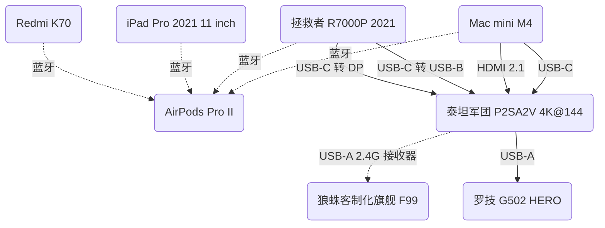

大家好啊，今天来点大家想看的东西啊。

一人多设备的情况已经很常见了，在此分享一下自己的多设备协同体验。

## 设备清单

|    设备    |          型号           |                                            简要备注                                             |
| :--------: | :---------------------: | :---------------------------------------------------------------------------------------------: |
|    手机    |       [Redmi K70]       |                                       单 USB-C；蓝牙 5.4                                        |
|    平板    | [iPad Pro 2021 11 inch] |                                  单雷雳 4 可 DP 1.4；蓝牙 5.0                                   |
|  ~~Mac~~   |    ~~[Mac mini M2]~~    |                     ~~双雷雳 4 可 DP 1.4；双 USB-A；单 HDMI 2.0；蓝牙 5.3~~                     |
|    Mac     |      [Mac mini M4]      |                 正双 USB-C 10 Gb/s；反三雷雳 4 可 DP 1.4；单 HDMI 2.1；蓝牙 5.3                 |
| 笔记本电脑 |  [拯救者 R7000P 2021]   |        单 HDMI 2.1；双 USB-C 10 Gb/s 可 DP 1.4，其一 PD 100 W；四 USB-A 5 Gb/s；蓝牙 5.1        |
|  蓝牙耳机  |    [AirPods Pro II]     |                                       单 USB-C；蓝牙 5.3                                        |
|   显示器   | 泰坦军团 P2SA2V 4K@144  | 单 DP 1.4 双 HDMI 2.1 均 DSC；单 USB-C 可 DP 1.2、PD 65 W，单 USB-B，其一作双 USB-A 5 Gb/s 上行 |
|    键盘    | 狼蛛客制化旗舰 F99 系列 |   单 USB-C，回报率 1000 Hz；蓝牙 5.0，回报率 125 Hz；无线 2.4G，回报率 1000 Hz；电池 8000 mAh   |
|    鼠标    |     罗技 G502 HERO      |                                   按键宏编程；双模式疾速滚轮                                    |

[Redmi K70]: https://www.mi.com/redmi-k70/specs
[iPad Pro 2021 11 inch]: https://support.apple.com/zh-cn/111897
[AirPods Pro II]: https://support.apple.com/zh-cn/111834
[Mac mini M2]: https://support.apple.com/zh-cn/111837
[Mac mini M4]: https://support.apple.com/zh-cn/121555
[拯救者 R7000P 2021]: https://item.lenovo.com.cn/product/1013207.html

## 参考信息

|      USB 协议      |                曾用名                 |   带宽   |
| :----------------: | :-----------------------------------: | :------: |
| USB 2.0 Low-Speed  |                USB 1.0                | 1.5 Mb/s |
| USB 2.0 Full-Speed |                USB 1.1                | 12 Mb/s  |
| USB 2.0 High-Speed |                USB 2.0                | 480 Mb/s |
|     USB 5 Gb/s     | USB 3.0、USB 3.1 Gen 1、USB 3.2 Gen 1 |  5 Gb/s  |
|    USB 10 Gb/s     | USB 3.1、USB 3.1 Gen 2、USB 3.2 Gen 2 | 10 Gb/s  |
|    USB 20 Gb/s     |            USB 3.2 Gen 2x2            | 20 Gb/s  |
|    USB 40 Gb/s     |              USB 4 V1.0               | 40 Gb/s  |
|    USB 80 Gb/s     |              USB 4 V2.0               | 80 Gb/s  |

|      参数      | 全功能 USB-C |  USB 40 Gb/s  | USB 80 Gb/s |   雷雳 3   |         雷雳 4         |         雷雳 5         |
| :------------: | :----------: | :-----------: | :---------: | :--------: | :--------------------: | :--------------------: |
|   带宽 Gb/s    |      10      |      40       |     80      |   20/40    |           40           |           80           |
|   PCIe Gb/s    |      -       |       -       |      -      |     16     |           32           |           64           |
|    外接显卡    |    不支持    |     可选      |    可选     |    强制    |          强制          |          强制          |
|    PD 供电     |  可选 100 W  |  可选 100 W   | 可选 240 W  | 可选 100 W | 标配 100 W，可选 140 W | 标配 140 W，可选 240 W |
|    反向供电    |    4.5 W+    |    7.5 W+     |   7.5 W+    |   15 W+    |         15 W+          |         15 W+          |
|    视频协议    | 可选 DP 1.4  |  可选 DP 2.1  | 可选 DP 2.1 |   DP 1.4   |         DP 1.4         |         DP 2.1         |
|    视频传输    |    4K@120    | 4K@240、8K@60 |    双 4K    |   双 4K    |         双 4K          |         双 8K          |
|   USB 4 规范   |     兼容     |     合规      |    合规     |    兼容    |          合规          |          合规          |
| Intel DMA 保护 |      -       |       -       |      -      |    可选    |          强制          |          强制          |
|    线材认证    |      -       |       -       |      -      |    强制    |          强制          |          强制          |

## 硬件互连

将各个设备用物理连接起来着实废了一番心思。

即便 [USB-C](https://en.wikipedia.org/wiki/USB-C) 能统一接口，各个接口具体支持什么协议也是模糊不清，要在网上搜每个设备的接口支持什么协议，并且还要有能满足这些协议的线材。有够烦人。

总之先讲讲我这套怎么搭的。

### 共享键鼠

首先将笔记本电脑和显示器用 USB-C 转 [DP](https://en.wikipedia.org/wiki/DisplayPort) 的线连接起来，显示器能以 4K@144 的预期模式显示画面，接着将鼠标和键盘 2.4G 接收器插至显示器 USB-A 口。

问题出现了，照理说这两外设应该连上笔记本电脑的，DP 协议是能够运送双向 USB 信号的 —— 总之再从笔记本电脑连出根 USB-C 转 USB-B 的线，显示器设置使 USB-B 作为上行。

再就是将显示器和 Mac 用双公口 USB-C 的线连接起来，显示器能以 4K@60 的 **惨淡** 模式显示画面 —— 询问客服后得知，显示器的 USB-C 口最高仅支持 4K@60。

不知道为什么，当显示器从 DP 信号源调转至 USB-C 信号源时，USB-C 会夺走 USB-B 上行身份，也就是这根 USB-C 线同时传输了视频信号和 USB 信号。

总之这样键盘和鼠标就能自如的在笔记本电脑和 Mac 之间切换了，更何况键盘还有 Android、Windows、macOS、iOS 四种模式，使用 <Kbd>Fn + Q/W/E/R</Kbd> 快捷键即可切换，非常方便。

### Mac mini M4

在更换 Mac mini M4 版本后，原先的 HDMI 2.0 接口变成了 HDMI 2.1，那么这个接口就能解决我们之前的问题了，在此使用一根海贝思的支持 8K@60（向下兼容 4K@240）的双 HDMI 公口线将 Mac mini 连接显示器，显示器能以 4K@144 的模式显示画面。

是的，如果使用这根线连接笔记本电脑的话，显示器并不能以 4K@144 的模式显示画面，只能支持到 4K@120，貌似是 [DSC 显示流压缩技术](https://en.wikipedia.org/wiki/Display_Stream_Compression) 并没起作用 …… 虽然说这也是挺高的刷新率了，但我就是希望顶满 144 Hz，因而笔记本电脑和显示器只能用 USB-C 转 DP 的线连接。

此外，显示器在切换信号源时并不会出现“夺走上行身份”这种事，而是显示器为每个信号源各自记忆上行接口，笔记本电脑仍使用 USB-B 作为上行，而 Mac mini 使用 USB-C 作为上行 —— 这里要注意的一点是，与 Mac mini 连接的这根双 USB-C 的线只能是充电线，不能是数据线，否则 Mac mini 既会从 HDMI 2.1 接口输出视频信号，又会从 USB-C 接口输出视频信号，就挺幽默的。

### 共享音频

在这里点名批评 Mac 的狗屎设计，连接显示器后就不能在状态栏调整音量了，想调只能去按显示器，纯傻逼 —— 据说有人为此就要买 Mac 不买 Windows 设备，因为 Windows 音质是有损的才能随意调音量 —— 巨傻逼，那我缺的这个音量调节谁给我补啊。

总之在试过几款软件后都觉得不尽人意，我就直接禁止 Mac 播放声音了。

对，解决办法是使用 AirPods Pro 无线连接 Mac，这样调节音量就扫扫耳机柄就行，更好的是，AirPods Pro 支持 Apple 设备音频串流，也就是说 Mac 和 iPad 能同时连接至耳机，哪一方有声音就播放哪一方 —— 等一下？为什么不是同时？傻逼 Apple 😅。

而笔记本电脑由于能随意调整音量，所以外放 OK，当然连耳机也行。

再说个有关蓝牙耳机的事，自我开始用 AirPods Pro 我才知道，原来其他设备是能在已有设备与耳机连接时打断连接并连接上的，这应该是蓝牙耳机都有的功能就是了。

多个题外话，Mac 能投屏至 iPad、能鼠标流转操作 iPad（两者意思不同），这个我真觉得很厉害，~~不觉得很酷吗？~~

## 软件互联

### 文件传输

非常推荐 [LocalSend](https://github.com/localsend/localsend) 喵！其是基于 Flutter 开发的全平台文件传输软件，只要是在一个局域网下的设备就能互传。

那我为什么不使用 [SMB](https://en.wikipedia.org/wiki/Server_Message_Block) 或 [FTP](https://en.wikipedia.org/wiki/File_Transfer_Protocol) 呢？因为太繁琐了，IP 地址会随着网络环境不同而改变，主机名、用户名、域、密码我还不知道哪个对应哪个，以及各个设备没有一个统一的界面，学习成本高。

<Alert
  title='2025-01-05T19:11:42+08:00 补充'
  description='实际上可以配置路由器以固定 IP'
/>

当然，如果非要使用 FTP 的话推荐软件 [MaterialFiles](https://github.com/zhanghai/MaterialFiles)，其之前在 [云盘同步及 Obsidian 相关](/post/Cloud-Drive-Sync-And-Obsidian-Related) 介绍过，能在 Android 设备上启动 FTP 服务器。

### Android 投屏至电脑

非常推荐 [scrcpy](https://github.com/Genymobile/scrcpy) 喵！其是一款特别厉害的投屏软件，支持有线连接 —— 好像也能无线？因为我第一次用这个的时候感觉它和 [ADB](https://developer.android.com/tools/adb) 挺像的 —— 以及鼠标控制、高刷 ……

具体的不多说了，稍微有点门槛的就是这是个没有 GUI 的软件，当然也可以去找人家包的 GUI。

## 杂项

### 桌面自定义

Windows 的可玩性比 macOS 高多了，[Wallpaper Engine](https://store.steampowered.com/app/431960/Wallpaper_Engine) 这玩意要是能有 macOS 版那我会笑醒，接下来大多讲的还是 Windows 方面的东西。

#### 程序坞

macOS 上有程序坞，Windows 有任务栏，但我可不想把程序全“固定到任务栏”，所幸有款名为 [LightFrame](https://lightframe.vertillusion.xyz) 的软件，其有一个组件是 Minecraft 物品栏程序坞，这可真是绝妙的点子，所以狠狠地用 —— 但它也有不足之处：作者不开源，加上年龄较小（？），代码很可能是一坨；存在置底设置经常失效的问题、存在不适配多显示器的问题（把它拖到外接显示器上，以后只用笔记本就看不到了）、存在不响应 [DPI](https://en.wikipedia.org/wiki/Dots_per_inch) 变化的问题 —— 显示器之间拖动大小不发生改变。

最大的问题是，我想在 macOS 上也用它，但是完全不支持。

个人是想在 Flutter 实现无头应用 —— 没有 GUI 也能后台运行的应用 —— 和多视图 —— 支持 0 个及 1 个以上的窗口 —— 后自己实现一个。

#### 鼠标宏

罗技鼠标支持按键宏编程，也就是支持按键映射，而且 Windows 和 macOS 都支持。

|      应用      | 配置                                                                                                       |
| :------------: | ---------------------------------------------------------------------------------------------------------- |
| Microsoft Edge | 左右推中键能 `返回标签页` 和 `重做标签页`，也就是浏览器历史跳转；拇指上下键能 `重开标签页` 和 `关闭标签页` |
|   Minecraft    | G Shift 键能间隔攻击，对于刷怪塔 AFK 很有帮助                                                              |
|     VSCode     | G Shift 键映射为 F5，方便调试；拇指上下键能 `跳转至上个位置` 和 `跳转至下个位置`，也就是光标位置历史跳转   |

玩法特别多，帮助也很大。

#### 全局工具

在 Windows 上推荐 [PowerToys](https://github.com/microsoft/PowerToys) 的 [PowerToys Run](https://learn.microsoft.com/zh-cn/windows/powertoys/run)，macOS 上推荐 [Raycast](https://www.raycast.com)。

使用什么快捷键来呼出快捷栏呢？在 Windows 上我是 `ctrl + win + alt + space`，在 macOS 上 ……

我哪知道，macOS 的键位好奇怪，我键盘切换到 macOS 模式后把 `win` 和 `alt` 互调了，然后我又在 macOS 设置里将 `command` 和 `ctrl` 对调了，这样才使得 macOS 的键位和 Windows 一致。

在此，macOS 上的要做的更好，扩展多 —— 翻译、词典、ChatGPT 对话等等，不过有些功能要订阅制付费 —— 能给每个功能自定义全局快捷键，界面还挺舒适 —— 相比之下 Windows 一开始的样式丑的我根本不想用 —— 补足了很多 macOS 本应该有的功能。

如：Windows 上 `win + v` 的剪切板，QQ 提供的 `ctrl + alt + a` 截图功能，Windows 上的 Everything 全局搜索功能。

对了，讲讲 [Everything](https://www.voidtools.com/support/everything)，这是 Windows 上很强力的一款全局搜索软件，能秒搜出结果，还支持正则表达式。

在它的最新版本 `1.5a (1.5.0.1366a)` 还支持了暗色模式，纯属鉴作！

#### 更好的 Windows 11

更好的 Windows 11 就是 Windows 10，Windows 11 有些地方真的不如 Windows 10，那么 [ExplorerPatcher](https://github.com/valinet/ExplorerPatcher) 就是把 Windows 11 改造的更像 Windows 10 的一个工具，部分功能如下：

- 自由切换 Win 10 和 Win 11 任务栏，支持设置标签合并、功能显示等。
- 恢复 Win 10 右键菜单和文件管理器命令栏。
- 切换开始菜单版本、禁用推荐、自动打开所有应用页面。
- 自定义应用切换器，可选 Win 11、Win 10、Win NT 等风格。

😤 微软，你好好看开发者怎么教你做事 😤

### 其他

更多的见 [此 GitHub 仓库](https://github.com/Cierra-Runis/desktop_modified)，里面分享了更多自定义工具。

## 拓扑图

使用 [Mermaid 在线预览](https://mermaid.live) 预览以下内容即可：

