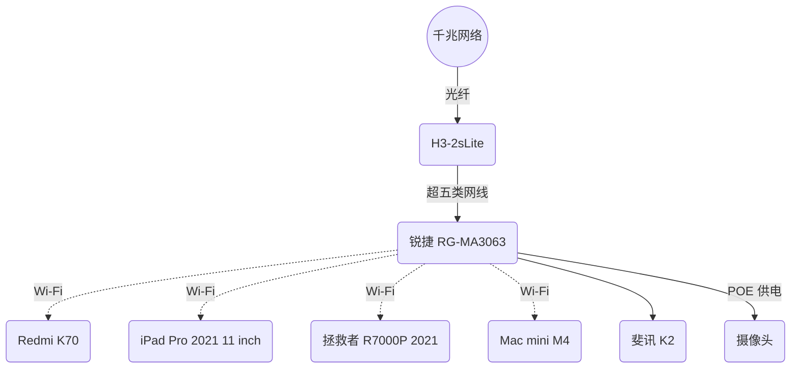

计算机网络很有意思，其有意思的点就在于，它结合了理论和实际，如果脱离其中一方，都会使整个内容变得枯燥无味。

让我们先列个表，看看自己所拥有的设备都支持哪些网络连接方式。

## 设备清单

|    设备    |          型号           |        有线         |      Wi-Fi 世代       |                    简要备注                     |
| :--------: | :---------------------: | :-----------------: | :-------------------: | :---------------------------------------------: |
|    手机    |       [Redmi K70]       |          -          | Wi-Fi 7[^1]、Wi-Fi 6E |           MLO；[MIMO] 2x2；[同步双频]           |
|    平板    | [iPad Pro 2021 11 inch] |          -          |       Wi-Fi 6E        |       2.4G、5G [同步双频]；[MIMO] 80 MHz        |
|    Mac     |      [Mac mini M4]      |    RJ45 千兆网口    |       Wi-Fi 6E        |                        -                        |
| 笔记本电脑 |  [拯救者 R7000P 2021]   |    RJ45 千兆网口    |        Wi-Fi 6        |                        -                        |
|    光猫    |        H3-2sLite        | 四 RJ45 千兆 LAN 口 |      不需要在意       |                        -                        |
|  主路由器  |    [锐捷 RG-MA3063]     |  四 RJ45 千兆网口   |        Wi-Fi 6        | 最高 3000 Mb/s；[MIMO] 2x2；四网口任一作 WAN 口 |
|  副路由器  |        [斐讯 K2]        |  五 RJ45 百兆网口   |        Wi-Fi 5        |      最高 1200 Mb/s；五网口其一固定 WAN 口      |

[^1]: Wi-Fi 7 相关功能需 OTA 升级后开放，具体时间需待有关监管部门批准后推送

[Redmi K70]: https://www.mi.com/redmi-k70/specs
[iPad Pro 2021 11 inch]: https://support.apple.com/zh-cn/111897
[Mac mini M4]: https://support.apple.com/zh-cn/121555
[拯救者 R7000P 2021]: https://item.lenovo.com.cn/product/1013207.html
[锐捷 RG-MA3063]: https://www.acwifi.net/21472.html
[斐讯 K2]: https://product.yesky.com/product/977/977854/param.shtml
[MIMO]: #mimo-配置
[同步双频]: #双频合一与同步双频

## 参考信息

### 有关比特、字节、速率的换算

- 换算关系
  - 1 Byte = 8 bit
  - 通信等领域
    - 1 KB = 1000 Byte
    - 1 MB = 1000 KB
    - 1 GB = 1000 MB
  - 计算机储存
    - 1 KiB = 1024 Byte
    - 1 MiB = 1024 KiB
    - 1 GiB = 1024 MiB
- 常见速率

  - 100 Mb/s = 12.5 MB/s
  - 1000 Mb/s = 125 MB/s

  - 10000 Mb/s = 1250 MB/s = 1.25 GB/s

个人很讨厌使用 bit 而不是 Byte 来表示速率，一点都不直观

### Wi-Fi 世代

下表来自 [维基百科](https://zh.wikipedia.org/wiki/Wi-Fi#%E4%B8%96%E4%BB%A3)：

| Wi-Fi 世代 | IEEE 标准  |   年份   |  最大速率  | 频段 GHz  |
| :--------: | :--------: | :------: | :--------: | :-------: |
|  Wi-Fi 4   | [802.11n]  |   2009   |  75 MB/s   |  2.4、5   |
|  Wi-Fi 5   | [802.11ac] |   2013   |  867 MB/s  |   5[^2]   |
|  Wi-Fi 6   | [802.11ax] |   2021   |  1.2 GB/s  |  2.4、5   |
|  Wi-Fi 6E  | [802.11ax] |   2021   |  1.2 GB/s  |   6[^3]   |
|  Wi-Fi 7   | [802.11be] | 2024[^4] | 5.765 GB/s | 2.4、5、6 |
|  Wi-Fi 8   | [802.11bn] | ~~2028~~ | 12.5 GB/s  | 2.4、5、6 |

[^2]: Wi-Fi 5 仅指定在 5 GHz 频段的操作，2.4 GHz 频段的操作由 Wi-Fi 4 指定

[^3]: Wi-Fi 6E 是指在 6 GHz 频段运行的 Wi-Fi 设备的行业名称，其提供了 Wi-Fi 6 的功能和特性并扩展到 6 GHz 频段

[^4]: Wi-Fi 联盟在 2024 年开始认证 Wi-Fi 7 设备，但截至 2025 年 1 月，Wi-Fi 7 尚未被正式批准

[802.11n]: https://zh.wikipedia.org/wiki/IEEE_802.11n
[802.11ac]: https://zh.wikipedia.org/wiki/IEEE_802.11ac
[802.11ax]: https://zh.wikipedia.org/wiki/Wi-Fi_6
[802.11be]: https://zh.wikipedia.org/wiki/Wi-Fi_7
[802.11bn]: https://zh.wikipedia.org/wiki/IEEE_802.11bn

- 在此注意 Wi-Fi 6 即我们目前最常用的 Wi-Fi 世代即可，而 Wi-Fi 7 的就属于战未来的了
- 且在中国大陆，6 GHz 的频段尚未开放 —— 也有可能永远不会开放

### MIMO 配置

下表来自 [Intel 支持知识库](https://www.intel.cn/content/www/cn/zh/support/articles/000005725/wireless/legacy-intel-wireless-products.html)：

| Wi-Fi 6 MIMO 单条流带宽 MHz | 最大速率 MB/s |
| :-------------------------: | :-----------: |
|             20              |    17.916     |
|             40              |    35.833     |
|             80              |      75       |
|             160             |      150      |

- 例：若设备为 MIMO 2x2 160 MHz，则查表计算最大速率为 $150 \times 2 = 300$ MB/s
- 大多数设备为 MIMO 2x2

### 双频合一与同步双频

双频合一，又称双频优选，需要支持~~即时~~同步双频 RSDB 或并发双频 SDB 的设备，指路由器同时开启 2.4 GHz 和 5 GHz 两个频段，让设备自行选择连接的频段。

总之是狗屎，不要用，而且它们的措辞还总是混合在一起，具体看看这个 [知乎回答](https://www.zhihu.com/question/355416265/answer/891769324)，不懂也没关系。

### 以太网 Ethernet

|   速度   |  非正式名称  | IEEE 标准 | 线缆类型 | 最大传输距离 m |
| :------: | :----------: | :-------: | :------: | :------------: |
| 10 Mb/s  |  10 BASE-T   |   802.3   |  双绞线  |      100       |
| 100 Mb/s |  100 BASE-T  |  802.3u   |  双绞线  |      100       |
|  1 Gb/s  | 1000 BASE-LX |  802.3z   |   光纤   |      5000      |
|  1 Gb/s  | 1000 BASE-T  |  802.3ab  |  双绞线  |      100       |
| 10 Gb/s  |  10 GBASE-T  |  802.3an  |  双绞线  |      100       |

## 网络互联

这里先提前说明一点，网络配置属实困难，光是我们上面的参考信息就占了很多篇幅，一些相关的计算机网络知识也并未在此列出，以及想法很多时候都只是想法，真要实际操作起来，还是会遇到很多问题的。就目前我家的网络配置来说，这并未是一个经过深思熟虑的结果，一些难以解决的问题 —— 比如墙内预埋线的规格问题 —— 也只能暂时搁置，等以后有能力、有财力再来解决。

我现在家里办理的是 1000 Mb/s 的光纤宽带，屋外的光纤线熔接与尾纤后接入光猫，光猫再通过 **~~超五类网线~~** 连接主路由器的 LAN1 口自动作为 WAN 口，主路由器的 LAN2 口连接副路由器的 WAN 口，副路由器的 LAN1 口连接 [Mac mini M4](#设备清单) 的 RJ45 网口，Mac mini M4 通过 Wi-Fi 连接 [iPad Pro 2021 11 inch](#设备清单)。

## 推荐软件

- [WiFiman Desktop](https://ui.com/download/app/wifiman-desktop)

## 注意事项

- 路由器不要开 [双频合一](#双频合一与同步双频)，前面提到了
- 代理会影响最高速率，例如我代理套餐最高是 25 MB/s，一旦走代理，就会限定在其以下

## 拓扑图

