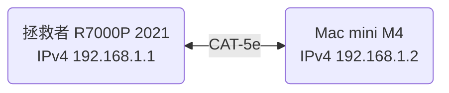
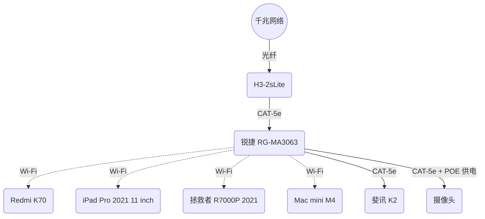

计算机网络很有意思，然而曾经的教学方式让我对它产生了厌恶感，这是令人悲哀的，我喜欢从现实出发，而不是从书本出发。

让我们先列个表，看看自己所拥有的设备都支持哪些网络连接方式。

## 设备清单

|    设备    |          型号           |        有线         |      Wi-Fi 世代       |                   简要备注                    |
| :--------: | :---------------------: | :-----------------: | :-------------------: | :-------------------------------------------: |
|    手机    |       [Redmi K70]       |          -          | Wi-Fi 7[^1]、Wi-Fi 6E |           MLO；MIMO 2x2；[同步双频]           |
|    平板    | [iPad Pro 2021 11 inch] |          -          |       Wi-Fi 6E        |       2.4G、5G [同步双频]；MIMO 80 MHz        |
|    Mac     |      [Mac mini M4]      |    RJ45 千兆网口    |       Wi-Fi 6E        |                       -                       |
| 笔记本电脑 |  [拯救者 R7000P 2021]   |    RJ45 千兆网口    |        Wi-Fi 6        |                       -                       |
|    光猫    |        H3-2sLite        | 四 RJ45 千兆 LAN 口 |      不需要在意       |                       -                       |
|  主路由器  |    [锐捷 RG-MA3063]     |  四 RJ45 千兆网口   |        Wi-Fi 6        | 最高 3000 Mb/s；MIMO 2x2；四网口任一作 WAN 口 |
|  副路由器  |        [斐讯 K2]        |  五 RJ45 百兆网口   |        Wi-Fi 5        |     最高 1200 Mb/s；五网口其一固定 WAN 口     |

[^1]: Wi-Fi 7 相关功能需 OTA 升级后开放，具体时间需待有关监管部门批准后推送

[Redmi K70]: https://www.mi.com/redmi-k70/specs
[iPad Pro 2021 11 inch]: https://support.apple.com/zh-cn/111897
[Mac mini M4]: https://support.apple.com/zh-cn/121555
[拯救者 R7000P 2021]: https://item.lenovo.com.cn/product/1013207.html
[锐捷 RG-MA3063]: https://www.acwifi.net/21472.html
[斐讯 K2]: https://product.yesky.com/product/977/977854/param.shtml
[同步双频]: #双频合一与同步双频

## 参考信息

提前声明：本文内容仅供参考，请以信息来源为准。

### 有关比特、字节、速率的换算

- 换算关系
  - 1 Byte = 8 bit
  - 通信等领域
    - 1 KB = 1000 Byte
    - 1 MB = 1000 KB
    - 1 GB = 1000 MB
  - 计算机储存
    - 1 KiB = 1024 Byte
    - 1 MiB = 1024 KiB
    - 1 GiB = 1024 MiB
- 常见速率
  - 100 Mb/s = 12.5 MB/s = 11.921 MiB/s
  - 1000 Mb/s = 125 MB/s = 119.21 MiB/s
  - 10000 Mb/s = 1.25 GB/s = 1.164 GiB/s

个人很讨厌使用 bit 而不是 Byte 来表示速率，一点都不直观，也讨厌千进制。

### Wi-Fi 世代

下表来自 [维基百科](https://zh.wikipedia.org/wiki/Wi-Fi#%E4%B8%96%E4%BB%A3)：

| Wi-Fi 世代 | IEEE 标准  |   年份   |   最大速率    | 频段 GHz  |
| :--------: | :--------: | :------: | :-----------: | :-------: |
|  Wi-Fi 4   | [802.11n]  |   2009   |    75 MB/s    |  2.4、5   |
|  Wi-Fi 5   | [802.11ac] |   2013   |   867 MB/s    |   5[^2]   |
|  Wi-Fi 6   | [802.11ax] |   2021   |   1.2 GB/s    |  2.4、5   |
|  Wi-Fi 6E  | [802.11ax] |   2021   |   1.2 GB/s    |   6[^3]   |
|  Wi-Fi 7   | [802.11be] | 2024[^4] | 2.88 GB/s[^5] | 2.4、5、6 |
|  Wi-Fi 8   | [802.11bn] | ~~2028~~ |   12.5 GB/s   | 2.4、5、6 |

[^2]: Wi-Fi 5 仅指定在 5 GHz 频段的操作，2.4 GHz 频段的操作由 Wi-Fi 4 指定

[^3]: Wi-Fi 6E 是指在 6 GHz 频段运行的 Wi-Fi 设备的行业名称，其提供了 Wi-Fi 6 的功能和特性并扩展到 6 GHz 频段

[^4]: Wi-Fi 联盟在 2024 年开始认证 Wi-Fi 7 设备，但截至 2025 年 1 月，Wi-Fi 7 尚未被正式批准

[^5]: 中文维基百科给出的数值已经过时，以英文维基百科为准

[802.11n]: https://zh.wikipedia.org/wiki/IEEE_802.11n
[802.11ac]: https://zh.wikipedia.org/wiki/IEEE_802.11ac
[802.11ax]: https://zh.wikipedia.org/wiki/Wi-Fi_6
[802.11be]: https://zh.wikipedia.org/wiki/Wi-Fi_7
[802.11bn]: https://zh.wikipedia.org/wiki/IEEE_802.11bn

- 在此注意 Wi-Fi 6 即我们目前最常用的 Wi-Fi 世代即可，而 Wi-Fi 7 的就属于战未来的了
- 且在中国大陆，6 GHz 的频段尚未开放 —— 也有可能永远不会开放🤗

### Wi-Fi 速率

参见 [此视频](https://www.bilibili.com/video/av787776505)：

Wi-Fi 最大速率 $=$ 编码方式 $\times$ 码率 $\times$ 最大信道有效子载波数量 $\times$ 单位时间符号传输数量 $\times$ 空间流数量

以 Wi-Fi 6 与 Wi-Fi 7 为例，其最大速率计算如下：

| Wi-Fi 世代 | 调制方式 | 编码方式 | 码率 |  带宽   | 单位时间符号传输数量 | 空间流数量 | 最大速率  |
| :--------: | :------: | :------: | :--: | :-----: | :------------------: | :--------: | :-------: |
|  Wi-Fi 6   | 1024-QAM |    10    | 5/6  | 160 MHz |        73529         |  MIMO 8x8  | 1.2 GB/s  |
|  Wi-Fi 7   | 4096-QAM |    12    | 5/6  | 320 MHz |        73529         |  MIMO 8x8  | 2.88 GB/s |

- 大多数设备为 MIMO 2x2，也即对应 300 MB/s 和 720 MB/s
- 有关调制方式参见 [此视频](https://www.bilibili.com/video/av113683137041105)

其实 [Wi-Fi 6 英文维基百科](https://en.wikipedia.org/wiki/Wi-Fi_6#Rate_set) 给出了单空间流最大速率表格，其相比于中文维基百科的更为简洁。

### 双频合一与同步双频

双频合一，又称双频优选，需要支持~~即时~~同步双频 RSDB 或并发双频 SDB 的设备，指路由器同时开启 2.4 GHz 和 5 GHz 两个频段，让设备自行选择连接的频段。

总之是狗屎，不要用，而且它们的措辞还总是混合在一起，具体看看这个 [知乎回答](https://www.zhihu.com/question/355416265/answer/891769324)，不懂也没关系。

### 以太网 Ethernet

|   速度   |  非正式名称   | IEEE 标准 | 线缆类型 | 最大传输距离 m |
| :------: | :-----------: | :-------: | :------: | :------------: |
| 10 Mb/s  |  [10BASE-T]   |   802.3   |  双绞线  |      100       |
| 100 Mb/s |   100BASE-T   |  802.3u   |  双绞线  |      100       |
|  1 Gb/s  | [1000BASE-LX] |  802.3z   |   光纤   |      5000      |
|  1 Gb/s  | [1000BASE-T]  |  802.3ab  |  双绞线  |      100       |
| 2.5 Gb/s | [2.5GBASE-T]  |  802.3bz  |  双绞线  |      100       |
|  5 Gb/s  |  [5GBASE-T]   |  802.3bz  |  双绞线  |      100       |
| 10 Gb/s  |  [10GBASE-T]  |  802.3an  |  双绞线  |      100       |

[10BASE-T]: https://zh.wikipedia.org/wiki/10BASE-T
[1000BASE-LX]: https://zh.wikipedia.org/wiki/吉比特以太网#1000BASE-LX
[1000BASE-T]: https://zh.wikipedia.org/wiki/吉比特以太网#1000BASE-T
[2.5GBASE-T]: https://zh.wikipedia.org/zh-cn/2.5GBASE-T與5GBASE-T
[5GBASE-T]: https://zh.wikipedia.org/zh-cn/2.5GBASE-T與5GBASE-T
[10GBASE-T]: https://zh.wikipedia.org/wiki/10吉比特乙太網路#10GBASE-T

### 双绞线 CAT

下表来自 [此视频](https://www.bilibili.com/video/av459211809)：

|   规格   | 常规屏蔽模式 | 常规线规 AWG | 带宽 MHz | 100 Mb/s | 1 Gb/s | 2.5 Gb/s | 5 Gb/s | 10 Gb/s |
| :------: | :----------: | :----------: | :------: | :------: | :----: | :------: | :----: | :-----: |
| [CAT-5]  |     UTP      |      24      |   100    |    🉑    |        |          |        |         |
| [CAT-5e] |     UTP      |      24      |   125    |    🉑    |   🉑   |  不稳定  | 不稳定 |         |
| [CAT-6]  |  UTP 或 STP  |      23      |   250    |    🉑    |   🉑   |    🉑    | 不稳定 |  55 m   |
| [CAT-6A] |     STP      |      23      |   500    |    🉑    |   🉑   |    🉑    |   🉑   |   🉑    |
| [CAT-7]  |    S/FTP     |      23      |   600    |    🉑    |   🉑   |    🉑    |   🉑   |   🉑    |
| [CAT-7A] |    S/FTP     |      22      |   1000   |    🉑    |   🉑   |    🉑    |   🉑   |   🉑    |

[CAT-5]: https://zh.wikipedia.org/wiki/CAT-5
[CAT-5e]: https://zh.wikipedia.org/wiki/CAT-5#Category_5e
[CAT-6]: https://zh.wikipedia.org/wiki/CAT-6
[CAT-6A]: https://zh.wikipedia.org/wiki/CAT-6#Category_6A
[CAT-7]: https://zh.wikipedia.org/wiki/CAT-7
[CAT-7A]: https://zh.wikipedia.org/wiki/CAT-7#Class_FA

- 超过 CAT-6A 线请考虑光纤

自己找到一根双绞线，上面写着 `AMPHENGKE CAT5E UTP 24AWG 4PAIR AWM 2835 60°C FT4 VERIFIED MADE IN CHINA 063 M`，其中 AMPHENGKE 为~~某不知名~~品牌，规格为 CAT-5e，线规为 24 AWG，最高温度为 60 °C，FT4 为 CSA 防火等级，VERIFIED 表示已验证，MADE IN CHINA 为产地，063 M 为长度标定以方便切割。

## 网络互联

这里先提前说明一点，网络配置属实困难，光是我们上面的参考信息就占了很多篇幅，一些相关的计算机网络知识也并未在此列出，以及想法很多时候都只是想法，真要实际操作起来，还是会遇到很多问题的。就目前我家的网络配置来说，这并未是一个经过深思熟虑的结果，一些难以解决的问题 —— 比如墙内预埋线的规格问题 —— 也只能暂时搁置，等以后有能力、有财力再来解决。

我现在家里办理的是 1000 Mb/s 的光纤宽带，屋外的光纤线熔接与尾纤后接入光猫，光猫再通过 CAT-5e 网线连接主路由器的 LAN1 口自动作为 WAN 口，主路由器的 LAN2 口连接副路由器的 WAN 口，副路由器的 LAN1 口连接 [Mac mini M4](#设备清单) 的 RJ45 网口，Mac mini M4 通过 Wi-Fi 连接 [iPad Pro 2021 11 inch](#设备清单)。

## 本地域名

首先要注意的一点是，在使用域名连接到本地时，请使用 `localhost`，几乎所有设备都会将其自动与 IPv4 下的 `127.0.0.1` 或 IPv6 下的 `::1` 绑定。

在 [多设备协同与自定义](/post/Multi-Device-Collaboration-And-Customize#桌面自定义) 中也有提到，IP 的变化是会令人难受的，固定 IP 虽然能解决该问题，但一是这要求你对路由器有管理权，二是路由器要具备能固定 IP 的功能，再就是一旦换到另一个局域网，就又得重新设置。而本地域名则不会有这些问题。

本地域名怎么获取呢？macOS 和 Windows 均使用 `hostname{:bash}` 命令即可，结果分别是 `Mac-mini.local` 和 `Cierra_Runis`。

当然，这里给一下 [保留 IP 地址](https://zh.wikipedia.org/zh-cn/%E4%BF%9D%E7%95%99IP%E5%9C%B0%E5%9D%80) 和 [IPv6 地址分配情况](http://comeround.cn/article/ipv6-address.html) 的链接，请自行查阅。为 [安全起见](http://hello.fe80.cn/pages/ipv6/i6.html) 请不要把保留 IP 地址外的地址公布 —— 由于 IPv6 的分配被严格管理，可以查到你设备的位置，我自己查能精确到县级。

下表来自 `ifconfig{:bash}` 和 `ipconfig /all{:bash}` 命令：

|        设备        |                IP                 |        类型        |
| :----------------: | :-------------------------------: | :----------------: |
|      Mac mini      |         ☀️192.168.2.69/24         | IPv4 局域网私有 IP |
|      Mac mini      | 🌞fe80::8bc:15d5:9bc3:9771%en1/64 | IPv6 链路本地地址  |
| 拯救者 R7000P 2021 |         🌕192.168.2.75/24         | IPv4 局域网私有 IP |
| 拯救者 R7000P 2021 | 🌝fe80::98b4:7a27:b5c0:d12f%18/64 | IPv6 链路本地地址  |

- 这里不知道为什么是 %en1 而下面是 %9，根据 [维基百科](https://zh.wikipedia.org/wiki/IPv6#cite_ref-rfc4007_7-0) 和 [RFC 4007](https://datatracker.ietf.org/doc/html/rfc4007#section-11.2)，不同的操作系统有着不同的命名。

就我自己，在 Mac mini 和拯救者 R7000P 2021 搭配 Clash Verge 虚拟网卡开启及关闭时，使用 `ping{:bash}` 命令得到以下结果：

|  操作系统   |        测试域名        |   ping 显示域名    | 双方皆关闭  |   双方皆打开    | 结果 |
| :---------: | :--------------------: | :----------------: | :---------: | :-------------: | :--: |
|    macOS    |         _Mac_          |      mac.lan       | 198.18.1.87 |   198.18.1.87   |  💢  |
|    macOS    |       _Mac.lan_        |      mac.lan       | 198.18.1.87 |   198.18.1.87   |  💢  |
|    macOS    |      _Mac.local_       |         -          |      -      |        -        |  💩  |
|   Windows   |         _Mac_          |      Mac.lan       |     ☀️      |       ☀️        |  💔  |
|   Windows   |       _Mac.lan_        |      Mac.lan       |     ☀️      | 198.18.0.69[^6] | 💢💢 |
|   Windows   |      _Mac.local_       |     Mac.local      |      -      | 198.18.0.70[^6] | 💢💢 |
|    macOS    |      ~~Mac-mini~~      |    mac-mini.lan    | 198.18.1.83 |   198.18.1.83   |  💢  |
|    macOS    |    ~~Mac-mini.lan~~    |    mac-mini.lan    | 198.18.1.83 |   198.18.1.83   |  💢  |
|    macOS    |   ~~Mac-mini.local~~   |   mac-mini.local   |  127.0.0.1  |    127.0.0.1    |  😄  |
|   Windows   |      **Mac-mini**      |   Mac-mini.local   |    🌞%9     |      🌞%9       |  🚀  |
|   Windows   |    **Mac-mini.lan**    |    Mac-mini.lan    |      -      | 198.18.0.71[^6] | 💢💢 |
| **Windows** |   **Mac-mini.local**   |   Mac-mini.local   |    🌞%9     | 198.18.0.72[^6] | 💢💢 |
|  **macOS**  |    **Cierra_Runis**    |  cierra_runis.lan  | 198.18.1.82 |   198.18.1.82   |  💢  |
|    macOS    |  **Cierra_Runis.lan**  |  cierra_runis.lan  | 198.18.1.82 |   198.18.1.82   |  💢  |
|    macOS    | **Cierra_Runis.local** | cierra_runis.local |     🌕      |       🌕        |  🚀  |
|   Windows   |    ~~Cierra_Runis~~    |    Cierra_Runis    |    🌝%18    |      🌝%18      |  😄  |
|   Windows   |  ~~Cierra_Runis.lan~~  |  Cierra_Runis.lan  |     🌕      | 198.18.0.73[^6] | 💢💢 |
|   Windows   | ~~Cierra_Runis.local~~ |    Cierra_Runis    |    🌝%18    |      🌝%18      |  😄  |

[^6]: Clash Verge 导致连续的 IP 地址变化

- 删除线部分为不需要的测试，请使用 `localhost` 代替
- 加粗部分为重要测试
- 斜线部分为不确定是否能在其他局域网复现的测试
- 💢: 不可用的 198.18.x.x 网段
- 💩: 完全不通
- 💔：此域名为路由器后台设备列表名称
- 💢💢：不可用的 198.18.x.x 网段且两次结果不一样
- 😄：“你老惦记你那本地域名干什么？那我缺的这个 `localhost` 谁给我补啊？”

总结下来，两个最重要的测试，四个结果只有一个可用，有点尴尬了。

而最后的结果很明显，Mac mini 给出的域名要去掉 `.local` 给 Windows 使用，而 Windows 反过来 —— 什么极限换家？

### Windows 与 macOS 在本地域名上的差异

在 Windows 上，使用 `hostname{:bash}` 命令得到的结果是设备名称，这可以通过 `设置 > 系统` 查看并修改 —— 在此我修改为 `Laptop`。

更新 Mac 版本后 `hostname{:bash}` 给出 `Mac.lan`。据查，有下表：

|                命令                 |        输出         |                           备注                            |
| :---------------------------------: | :-----------------: | :-------------------------------------------------------: |
|          `hostname{:bash}`          |       Mac.lan       |           使用 `fastfetch{:bash}` 会看到 `Mac`            |
|   `scutil --get HostName{:bash}`    |  HostName: not set  |                             -                             |
| `scutil --get LocalHostName{:bash}` |      Mac-mini       | 在 `系统设置 > 共享` 能看到，接续的 `.local` 是无法更改的 |
| `scutil --get ComputerName{:bash}`  | 某不科学の Mac mini |              在 `系统设置 > 关于本机` 能看到              |

我们测试最终结果是：

| 操作系统 |    测试域名    | ping 显示域名  |    双方皆打开    |
| :------: | :------------: | :------------: | :--------------: |
|  macOS   |     Laptop     |   laptop.lan   |        🌕        |
|  macOS   |   Laptop.lan   |   laptop.lan   |        🌕        |
|  macOS   |  Laptop.local  |  laptop.local  |        🌕        |
| Windows  |    Mac-mini    | Mac-mini.local |       🌞%9       |
| Windows  |  Mac-mini.lan  |  Mac-mini.lan  | 198.18.0.127[^6] |
| Windows  | Mac-mini.local | Mac-mini.local | 198.18.0.129[^6] |

因而我们在 [本地域名](#本地域名) 一节中给出的结论仍然适用。

补充一下，在路由器后台能看到设备列表中，Windows 设备的名称变为了 `Laptop`，而 Mac mini 的名称是 `Mac`。

尝试使用 `sudo scutil --set HostName 'Mac-mini.local'{:bash}` 并重启机器看看结果又会如何 —— 答案是测试结果毫无变化，而前一张表前两个输出都变为了 `Mac-mini.local` —— 记得使用 `sudo scutil --set HostName ''{:bash}` 重新清空。

## 回到过去

两台设备直接使用网线连接，这就是最简单的局域网 —— 教程可参考 [此视频](https://www.bilibili.com/video/av424790900)：

为了防止 Wi-Fi 影响我们这次实验，先关闭笔记本电脑和 Mac mini 的 Wi-Fi，然后使用一根 CAT-5e 的网线将它们连接起来，接着我们做一下简单的配置：

|         笔记本电脑          |          Mac mini           |
| :-------------------------: | :-------------------------: |
|        Windows 设置         |          系统设置           |
|       网络和 Internet       |            网络             |
|           以太网            |           以太网            |
|            编辑             |          详细信息           |
|          选择手动           |          配置 IPv4          |
|          打开 IPv4          |          选择手动           |
| IP 地址填入 192.168.1.**1** | IP 地址填入 192.168.1.**2** |
| 子网掩码填入 255.255.255.0  | 子网掩码填入 255.255.255.0  |

这样我们就有了以下的局域网拓扑图：



由于两个设备的 RJ45 接口和 CAT-5e 网线都支持 1000 Mb/s，我们可以使用 [iperf3](https://github.com/esnet/iperf) 来测试两台设备之间的最大传输速率：

在 Mac mini 使用 `iperf3 -s{:bash}` 开启服务器，在笔记本电脑上使用 `iperf3 -c 192.168.1.2{:bash}` 连接服务器，测试结果如下：

<details>
  <summary>点击显示测试结果</summary>

```powershell
PS > iperf3 -c 192.168.1.2
Connecting to host 192.168.1.2, port 5201
[  5] local 192.168.1.1 port 55591 connected to 192.168.1.2 port 5201
[ ID] Interval           Transfer     Bitrate
[  5]   0.00-1.01   sec   117 MBytes   976 Mbits/sec
[  5]   1.01-2.01   sec   113 MBytes   944 Mbits/sec
[  5]   2.01-3.01   sec   113 MBytes   945 Mbits/sec
[  5]   3.01-4.01   sec   112 MBytes   940 Mbits/sec
[  5]   4.01-5.01   sec   113 MBytes   949 Mbits/sec
[  5]   5.01-6.01   sec   113 MBytes   946 Mbits/sec
[  5]   6.01-7.01   sec   112 MBytes   948 Mbits/sec
[  5]   7.01-8.01   sec   113 MBytes   950 Mbits/sec
[  5]   8.01-9.01   sec   113 MBytes   944 Mbits/sec
[  5]   9.01-10.01  sec   113 MBytes   944 Mbits/sec
- - - - - - - - - - - - - - - - - - - - - - - - -
[ ID] Interval           Transfer     Bitrate
[  5]   0.00-10.01  sec  1.11 GBytes   949 Mbits/sec                  sender
[  5]   0.00-10.03  sec  1.10 GBytes   945 Mbits/sec                  receiver

iperf Done.
```

反向测试如下：

```powershell
PS > iperf3 -c 192.168.1.2 -R
Connecting to host 192.168.1.2, port 5201
Reverse mode, remote host 192.168.1.2 is sending
[ 5] local 192.168.1.1 port 57949 connected to 192.168.1.2 port 5201
[ ID] Interval Transfer Bitrate
[ 5] 0.00-1.00 sec 113 MBytes 943 Mbits/sec
[ 5] 1.00-2.00 sec 113 MBytes 945 Mbits/sec
[ 5] 2.00-3.00 sec 113 MBytes 947 Mbits/sec
[ 5] 3.00-4.00 sec 112 MBytes 943 Mbits/sec
[ 5] 4.00-5.00 sec 113 MBytes 948 Mbits/sec
[ 5] 5.00-6.00 sec 113 MBytes 948 Mbits/sec
[ 5] 6.00-7.00 sec 113 MBytes 948 Mbits/sec
[ 5] 7.00-8.01 sec 113 MBytes 948 Mbits/sec
[ 5] 8.01-9.01 sec 113 MBytes 948 Mbits/sec
[ 5] 9.01-10.01 sec 102 MBytes 851 Mbits/sec

---

[ ID] Interval Transfer Bitrate
[ 5] 0.00-10.01 sec 1.09 GBytes 937 Mbits/sec sender
[ 5] 0.00-10.01 sec 1.09 GBytes 937 Mbits/sec receiver

iperf Done.
```

</details>

双向网速都在 936 Mb/s = 117 MB/s 以上，非常完美🥵，而且不得不说，Wi-Fi 比双绞线复杂太多了，双绞线一插就能近乎满速，Wi-Fi 就 ……

## 推荐软件

- [WiFiman Desktop](https://ui.com/download/app/wifiman-desktop)

## 注意事项

- 路由器不要开 [双频合一](#双频合一与同步双频)，前面提到了
- 代理会影响最高速率，例如我代理套餐最高是 25 MB/s，一旦走代理，就会限定在其以下

## 拓扑图

使用 [Mermaid 在线预览](https://mermaid.live) 预览以下内容即可：


